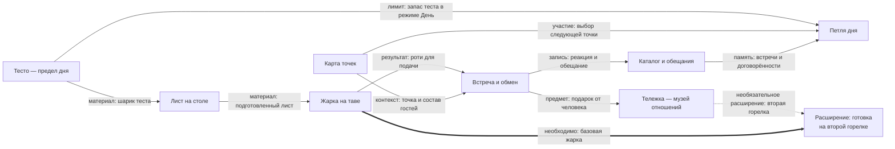

# Roti Stand — карта

> Вечерняя макашница на тайском острове: руками превращаешь комок теста в тонкую золотистую вещь,
> и деревня начинает знать тебя по запаху теста и хрустящему краю. Платят не деньгами — едой,
> услугой, слухом, обещанием. К концу тележка становится музеем отношений.

Это приборная панель проекта: где мы, из чего игра состоит и что осталось. Факты о мире живут
в своих заметках и только там; канон — в `docs/`.

## Стадия

Кода игры **нет ни строки**: ни `game/`, ни `src/`, стек не выбран. Стадия — доки и ревью корпуса.
Единственное, что играется, — стенд крупного плана теста.

| Что | Сколько | Чем меряется |
|---|---|---|
| Работает в игре | **0 из 8 механик** | игрового кода в репозитории нет; веха «Выбор стека» — 22 открытые задачи при 13 закрытых |
| Собрано, но не в игре | **2 из 8** — [[Лист на столе]], [[Жарка на таве]] | стенд `prototype/dough-closeup/`, 41-я сборка; в ветке `codex/roti-continuation` цикл замкнут — все семь шагов готовки; в `main` — первые пять, жарка без двух сторон и переворота, снятия и подачи нет |
| Описано, ждёт кода | **6 из 8** | дизайн-док на 416 строк, 69 записей в журнале решений, 38 заметок хранилища; вехи «v0» — 27 открытых задач, «v1» — 23 |
| Чего нет вовсе | звук, арт, персонажи, сохранение | звукового прототипа нет ни в проекте, ни в плане, замер «готовность на слух» (#14) не проводился; арт — единственная открытая развилка (#1); персонажей в v1 нужно 8, в коде 0 |

Всего на доске **72 открытые задачи** и 32 закрытые. Открытых вопросов о мире — **один из двенадцати**:
19.09.2026 одиннадцать закрыты разом.

## Как это устроено

Это **обзор потоков между восемью механиками**, а не граф обязательных зависимостей и не порядок
разработки. Девятый узел отдельно показывает расширение: готовку на второй горелке.

Читать нужно **по подписи стрелки**, а не по соседству узлов:

- **Сплошная тонкая стрелка `→`**: материал, результат, контекст или участие в петле.
  Такая связь сама по себе не означает «без этого нельзя запустить».
- **Пунктирная стрелка `⇢`**: необязательное расширение. Вторая горелка расширяет готовку,
  но не открывает базовую жарку.
- **Толстая стрелка `⇒` с подписью «необходимо»**: обязательная предпосылка именно указанной
  возможности. Здесь базовая жарка нужна для её расширения, а не наоборот.

Имена механик соответствуют заметкам в списке ниже. Размер и положение узла не показывают
готовность, стоимость реализации или приоритет.

Предмет от человека может расширить готовку: это прогресс через отношения, а не требование
получить подарок до первого роти. **Обратной обязательной связи «Тележка → базовая жарка» нет.**

Связь «Тесто → Лист» обозначает материал, не ожидание новой партии. **v0/Zen не требует петли дня,
карты, гостей или реального восполнения теста**; обзор показывает и будущий режим День.
Каталог хранит память, но не завершает день: невыполненное обещание не блокирует игру.
Карта участвует в выборе точек, а не является условием каждой встречи: первый день проходит у дома.

### Что означает граф ссылок Obsidian

Встроенный Graph View показывает другое: **заметка → заметка, на которую она ссылается**.
Его стрелка не означает «причина → следствие» или «условие → зависимая механика», а размер узла
отражает число ссылающихся заметок, не важность системы
([Obsidian: Graph view](https://obsidian.md/help/plugins/graph)).
Цветовые группы нашего графа различают папки, не статус канона или готовность кода.

Смысл межсистемных ссылок записан в свойствах карточек механик. Свойство читается
**от текущей заметки к указанной**; поэтому `материал-из: [[Лист на столе]]` у жарки
ссылается в обратную сторону относительно потока материала `Лист → Жарка` на схеме выше.
Это разные представления, не противоречие.

| Свойство текущей заметки | Как читать ссылку |
|---|---|
| `материал-из` | Получает материал от указанной механики; не наследует её ограничения режима День |
| `блюдо-из` | Получает приготовленное блюдо для подачи |
| `контекст-из` | Использует контекст места и гостей; не обязательный шаг для каждой встречи |
| `записи-из` | Получает сведения для памяти, не обязательное условие существования всего каталога |
| `предметы-из` | Получает предметы через отношения и обмен |
| `расширения-из` | Получает необязательные расширения; базовая возможность доступна без них |
| `лимит-из` | Берёт ограничение режима День; правило его восполнения остаётся вопросом #67 |
| `выбор-точки-через` | Использует экран выбора точки, когда он доступен |
| `память-в` | Хранит сведения о дне в указанной системе; не условие окончания дня |

Это обычные списковые свойства с внутренними ссылками, не новая настройка плагина
([Obsidian: Properties](https://help.obsidian.md/properties)).
Graph View не получает из них отдельную легенду типов рёбер: смысл читается здесь, в свойствах
заметки и в подписанной Mermaid-схеме. Цикл обычных ссылок не доказывает цикл обязательных зависимостей.
Список свойств описывает показанные связи, но не является полным контрактом всех входов каждой системы.

[[На чём это стоит]] отвечает на отдельный вопрос: какие тексты проверить при изменении решения.
Её связи влияния нельзя читать ни как порядок действий игрока, ни как обязательные зависимости игры.

## Механики

- [[Тесто — предел дня]] — сколько шариков заготовил, столько роти и сделал; единственный предел дня.
  **Задумано; тут же единственный открытый вопрос мира (#67), и механика замеса не описана (#39).**
- [[Лист на столе]] — расплющить, растянуть шлепками, перенести жестом-«запятая»; разрыв — узор, не провал.
  **Собрано в стенде**, в игре нет; дырка в стенде почти недостижима — потолок площади.
- [[Жарка на таве]] — палец = лопатка, готовность ведёт звук; пузыри, маргарин, переворот, уголь.
  **Собрано в стенде (ветка)**, в игре нет; конверта как состояния в модели нет (#20).
- [[Карта точек]] — карта это экран выбора точки, «точка × фаза дня»; ездить не нужно.
  **Решено 19.09, кода нет.**
- [[Встреча и обмен]] — гость отвечает едой, услугой, слухом, обещанием; монет в игре нет.
  **Описано, кода нет**; персонажи — самая дорогая статья корпуса.
- [[Каталог и обещания]] — ингредиенты, следы роти и договорённости; память дня и сток коллекции.
  **Описано; состав карточки следа открыт (#50)**, в стенде карточка-заглушка.
- [[Тележка — музей отношений]] — предметы приходят только от людей, покупок и ступеней нет.
  **Описано; два технических долга не выполнены.**
- [[Петля дня]] — утро дома → точка → встречи → закрытие; день кончается, когда кончилось тесто.
  **Описано; чем исключена одновременность точек — открыто (#67).**

Каталог каждой механики — её строки и их состояние — лежит внутри её заметки, а не здесь.

## Что осталось

**Открытый вопрос один — тесто, [#67](https://github.com/newYurk/roti-stand/issues/67).**
Как заготовка задаёт ритм дня, не заставляя ждать реального времени. Три требования в натяжении:
игра не запирает игрока · заготовка имеет вес · замес как ритуал начала дня. Решение 07.09
(восполняется реальным временем, ориентир — следующие сутки) владелица 19.09 мягко оспорила,
и оно ждёт пересмотра явно, а не молча.

Он держит больше, чем выглядит: на нём стоят [[Петля дня]] (чем сдвигается фаза и чем исключена
одновременность точек), [[Тесто — предел дня]] целиком, [[Первый день — черновик]] и
[[Семейный дом Мали]]. Что именно перепишется, если решить иначе, — [[На чём это стоит]];
ту схему эта заметка не дублирует и не отменяет.

Два технических долга, не требующих решения, а требующих правки: лежанка на тележке написана под
отменённого трёхцветного кота, и в слоте 2 висит гирлянда от монаха Луанга, которого нет в каноне.
Оба — в [[Тележка — музей отношений]].

## Чего здесь нет

- **Мира.** Люди, места и тайны живут в своих заметках: `01 Люди` (начать с [[Бабушка Мали]]),
  `02 Мир` ([[Деревня Банг Сао]]), `03 Тайны` ([[Тетрадь с ложкой]]).
- **Канона.** Дизайн-док `docs/roti-design-doc.md` и журнал решений `docs/decisions-log.md` старше
  всего, что здесь написано. Что в черновиках спорит с принятым — [[Сверки черновика мира]].
- **Текущей правки.** Где именно сейчас работа, какая сборка и что сломано — `STATE.md`.
- **Счётчика задач.** Он только на доске: [issues репозитория](https://github.com/newYurk/roti-stand/issues).
- **Рисунков владелицы.** Кадры и наброски — в `Рисунки/`, их читают, а не правят.
