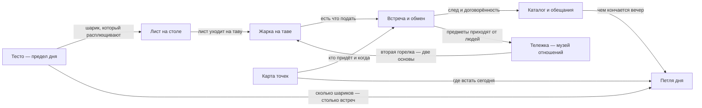

# Roti Stand — карта

> Вечерняя макашница на тайском острове: руками превращаешь комок теста в тонкую золотистую вещь,
> и деревня начинает знать тебя по запаху теста и хрустящему краю. Платят не деньгами — едой,
> услугой, слухом, обещанием. К концу тележка становится музеем отношений.

Это приборная панель проекта: где мы, из чего игра состоит и что осталось. Факты о мире живут
в своих заметках и только там; канон — в `docs/`.

## Стадия

Кода игры **нет ни строки**: ни `game/`, ни `src/`, стек не выбран. Стадия — доки и ревью корпуса.
Единственное, что играется, — стенд крупного плана теста.

| Что | Сколько | Чем меряется |
|---|---|---|
| Работает в игре | **0 из 8 механик** | игрового кода в репозитории нет; веха «Выбор стека» — 22 открытые задачи при 13 закрытых |
| Собрано, но не в игре | **2 из 8** — [[Лист на столе]], [[Жарка на таве]] | стенд `prototype/dough-closeup/`, 41-я сборка; в ветке `codex/roti-continuation` цикл замкнут — все семь шагов готовки; в `main` — первые пять, жарка без двух сторон и переворота, снятия и подачи нет |
| Описано, ждёт кода | **6 из 8** | дизайн-док на 416 строк, 69 записей в журнале решений, 38 заметок хранилища; вехи «v0» — 27 открытых задач, «v1» — 23 |
| Чего нет вовсе | звук, арт, персонажи, сохранение | звукового прототипа нет ни в проекте, ни в плане, замер «готовность на слух» (#14) не проводился; арт — единственная открытая развилка (#1); персонажей в v1 нужно 8, в коде 0 |

Всего на доске **72 открытые задачи** и 32 закрытые. Открытых вопросов о мире — **один из двенадцати**:
19.09.2026 одиннадцать закрыты разом.

## Как это устроено

Восемь механик. Стрелка ведёт от того, **без чего не работает**, к тому, что на нём стоит:
чтобы жарить — нужен лист, чтобы лист — нужно тесто. Узлы кликабельны.

Один круг здесь не ошибка: тележка растёт от людей и возвращается в готовку второй горелкой.
Это и есть «диегетический прогресс» — игра замыкается через отношения, а не через прогресс-бар.

## Механики

- [[Тесто — предел дня]] — сколько шариков заготовил, столько роти и сделал; единственный предел дня.
  **Задумано; тут же единственный открытый вопрос мира (#67), и механика замеса не описана (#39).**
- [[Лист на столе]] — расплющить, растянуть шлепками, перенести жестом-«запятая»; разрыв — узор, не провал.
  **Собрано в стенде**, в игре нет; дырка в стенде почти недостижима — потолок площади.
- [[Жарка на таве]] — палец = лопатка, готовность ведёт звук; пузыри, маргарин, переворот, уголь.
  **Собрано в стенде (ветка)**, в игре нет; конверта как состояния в модели нет (#20).
- [[Карта точек]] — карта это экран выбора точки, «точка × фаза дня»; ездить не нужно.
  **Решено 19.09, кода нет.**
- [[Встреча и обмен]] — гость отвечает едой, услугой, слухом, обещанием; монет в игре нет.
  **Описано, кода нет**; персонажи — самая дорогая статья корпуса.
- [[Каталог и обещания]] — ингредиенты, следы роти и договорённости; память дня и сток коллекции.
  **Описано; состав карточки следа открыт (#50)**, в стенде карточка-заглушка.
- [[Тележка — музей отношений]] — предметы приходят только от людей, покупок и ступеней нет.
  **Описано; два технических долга не выполнены.**
- [[Петля дня]] — утро дома → точка → встречи → закрытие; день кончается, когда кончилось тесто.
  **Описано; чем исключена одновременность точек — открыто (#67).**

Каталог каждой механики — её строки и их состояние — лежит внутри её заметки, а не здесь.

## Что осталось

**Открытый вопрос один — тесто, [#67](https://github.com/newYurk/roti-stand/issues/67).**
Как заготовка задаёт ритм дня, не заставляя ждать реального времени. Три требования в натяжении:
игра не запирает игрока · заготовка имеет вес · замес как ритуал начала дня. Решение 07.09
(восполняется реальным временем, ориентир — следующие сутки) владелица 19.09 мягко оспорила,
и оно ждёт пересмотра явно, а не молча.

Он держит больше, чем выглядит: на нём стоят [[Петля дня]] (чем сдвигается фаза и чем исключена
одновременность точек), [[Тесто — предел дня]] целиком, [[Первый день — черновик]] и
[[Семейный дом Мали]]. Что именно перепишется, если решить иначе, — [[На чём это стоит]];
ту схему эта заметка не дублирует и не отменяет.

Два технических долга, не требующих решения, а требующих правки: лежанка на тележке написана под
отменённого трёхцветного кота, и в слоте 2 висит гирлянда от монаха Луанга, которого нет в каноне.
Оба — в [[Тележка — музей отношений]].

## Чего здесь нет

- **Мира.** Люди, места и тайны живут в своих заметках: `01 Люди` (начать с [[Бабушка Мали]]),
  `02 Мир` ([[Деревня Банг Сао]]), `03 Тайны` ([[Тетрадь с ложкой]]).
- **Канона.** Дизайн-док `docs/roti-design-doc.md` и журнал решений `docs/decisions-log.md` старше
  всего, что здесь написано. Что в черновиках спорит с принятым — [[Сверки черновика мира]].
- **Текущей правки.** Где именно сейчас работа, какая сборка и что сломано — `STATE.md`.
- **Счётчика задач.** Он только на доске: [issues репозитория](https://github.com/newYurk/roti-stand/issues).
- **Рисунков владелицы.** Кадры и наброски — в `Рисунки/`, их читают, а не правят.
