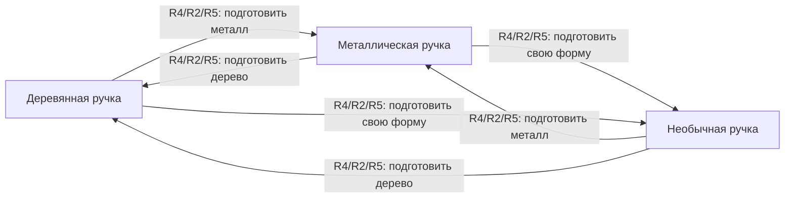

# Личный мир — варианты и переходы

> Рабочая записка · 19.09.2026. Направление сформулировано владелицей, примеры условий предложены для обсуждения. Это не новый утверждённый канон и не реализованная механика. Всё можно пересмотреть.

Игрок не просто открывает одинаковые награды: у него постепенно складывается свой мир.
Один и тот же человек может подарить разным игрокам разные варианты вещи. Если хочется другой
вариант, к нему можно прийти через действия и отношения, а не покупку или перезапуск.

## Что хотим сохранить

- **Личное блюдо.** Раскладка начинки, нарезка, цвет и полив отличаются. [[Карточка следа — черновик|Дневник]] сохраняет именно этот результат.
- **Личные вещи.** Пример владелицы: у одной лопатки бывают деревянная, металлическая или необычная ручка, хотя даритель один.
- **Личный вид мира.** Детали мест, карты и отношения отражают прожитую историю. Насколько меняются география и состав персонажей, ещё не решено.
- **Право передумать.** Другой вариант доступен через понятный путь. «Ветка» здесь означает состояние истории/мира, не Git и не автоматически новое сохранение.
- **Не магазин улучшений.** Варианты не должны незаметно превратиться в лестницу «хуже → лучше» или случайную редкость.

Отличие от [[Тележка — музей отношений|нынешнего описания тележки]]: там состояния различаются по
дарителю; здесь один даритель тоже может предложить разные вещи. Пример лопатки не отменяет
управление «палец = лопатка» и не вводит обязательный инструмент в готовку.

## Где хранить зависимости

Рекомендация: оставить Obsidian как понятное место для проектирования. В одной заметке на систему
держать смысл, таблицу правил и небольшую схему переходов. Ссылки между заметками служат навигацией,
а не исполняемыми условиями.

| Носитель | На какой вопрос отвечает |
|---|---|
| Описание | Зачем это игроку и что он чувствует? |
| Таблица правил | Что должно произойти, при каких условиях и что изменится? |
| Схема состояний | Откуда и куда можно перейти, есть ли путь обратно? |
| Таблица проверок | Что получится в нескольких конкретных прохождениях? |
| GitHub issue | Что осталось придумать, проверить или реализовать? |

После проверки одного случая правила можно перенести в данные игры и автоматические тесты.
Не стоит сейчас строить универсальный редактор всей деревни или поддерживать две независимые
версии одних и тех же условий: схема иллюстрирует таблицу, а не добавляет свои правила.

## Пример: один мастер и три ручки

Весь пример ниже является предложением. Мастер условный: новая биография персонажа не утверждается.
Отдельно предстоит проверить, подходит ли работа над рукоятями самим героям и стилю игры.

| Вариант | Пример совместного действия | Что различается |
|---|---|---|
| Деревянная ручка | Обсудить удобство и вместе обработать выбранную деревянную заготовку | Материал, форма, фактура, звук касания |
| Металлическая ручка | Рассмотреть образец и вместе подобрать безопасную форму крепления | Материал, блик, звук касания |
| Необычная ручка | Принести личный рисунок/идею и вместе придумать составную форму | Силуэт и памятная деталь; не редкость и не бонус |

Действия не должны быть счётчиками «принеси десять вещей». В этом примере материалы доступны в
мастерской, а подготовка является маленькой совместной сценой, не ежедневным гриндом.
Игрок может прямо сказать, что ему нравится. Система не обязана тайно угадывать его личность.

### Какие факты понадобятся

Предлагаемый минимум: текущий вариант; даритель; выбранный целевой вариант; завершена ли его
подготовка; ранее опробованные варианты; история подарка и переделок. Текущий выбор меняется,
но память о дарителе и прежнем виде не стирается.

### Правила переходов

| ID | Откуда и событие | Условия | Изменение и объяснение игроку | Повторение и конфликт |
|---|---|---|---|---|
| R1 | Подарка ещё нет; разговор о будущей вещи | Для учебного примера мастер уже знаком с героем и предлагает совместную работу | Игрок выбирает целевой вариант, мастер объясняет подготовку. Предмет ещё не появляется | Подходят несколько вариантов: показать выбор, не бросать жребий |
| R2 | Выбран вариант; завершена его совместная сцена | Сцена относится к текущему целевому варианту | Подготовка отмечена завершённой; можно принять результат | Повтор события ничего не дублирует; смена цели не переносит готовность на другую сцену |
| R3 | Принять первый подарок | Нет текущего предмета; подготовка выбранного варианта завершена | Появляется выбранный вариант; сохраняются даритель и история. Мастер называет выбранную деталь | Один подарок, не несколько за повторный клик |
| R4 | Есть предмет; попросить переделать | Цель отличается от текущего вида | Мастер предлагает сцену подготовки другого варианта; старая вещь остаётся до подтверждения | Просьбу можно отменить. Новый запрос заменяет незавершённую цель, но не текущую вещь |
| R5 | Подтвердить переделку | Есть предмет; выполнена подготовка текущей цели; цель отличается | Меняется только вариант; добавляется запись о переделке, даритель сохраняется | Повтор события не дублирует запись. Тот же путь доступен обратно |
| R6 | Отменить просьбу или не выполнить условие | Любое незавершённое изменение | Текущий предмет не меняется. Мастер объясняет недостающее действие без штрафа | Нет скрытого запасного правила, таймера или случайного замещения |

Для ранее опробованного варианта предлагается короткая сцена восстановления с мастером, а не
повтор всей добычи. Это тоже действие, не покупка. Подготовку и финальное подтверждение следует
развести: случайное касание не должно менять дорогую игроку вещь.

### Как читать схему

Прямоугольник означает текущий вид предмета. Каждая стрелка означает завершённый переход по R4/R2/R5:
разговор → подготовка целевого варианта → подтверждение. Это не покупка, не дружба и не обычная ссылка.
R1–R3 описывают первый подарок и на этой маленькой схеме не показаны.

### Проверяем до расширения на деревню

| Ситуация | Ожидаемый результат предложенных правил |
|---|---|
| Три игрока выбирают и готовят разные варианты у одного мастера | Три разные вещи, один даритель, одинаковая базовая функция |
| Игрок хочет металл после деревянной ручки | Может попросить сейчас; вещь меняется только после R2 и R5 |
| Игрок передумал посреди подготовки | Деревянная ручка остаётся, потерянного подарка нет |
| Доступны две истории, подходят два варианта | Выбор игрока, не скрытый приоритет и не случайность |
| Дерево → металл → дерево | Возвращается желаемый вид; сохраняется история обоих изменений |
| Повтор подтверждения или загрузка после него | Один результат и одна запись, не второй подарок |
| Игрок ничего не меняет или возвращается после перерыва | Текущий вариант сохраняется, основной путь готовки не блокируется |

Это ожидаемые результаты для проверки, не отчёт о выполненных игровых тестах.

## Как распространить на карту и набор изображений

Предлагаю начать с общей узнаваемой карты и нескольких меняющихся деталей одной точки:
навеса, скамьи, фонаря. Это ещё не утверждение процедурно генерируемой географии.
У каждой детали будет своё состояние и правило появления; декоративный вариант не должен
незаметно закрывать место, человека или основной рецепт.

Фраза «тильда-шит» сохранена как неуточнённый термин. Если имеется в виду tilesheet/лист вариантов,
для первого примера достаточно показать один предмет в трёх состояниях: общий масштаб и зона
касания, материал, видимый отклик. Полный атлас, разрешение и способ сборки сцены пока не назначаются.

У отношений и сюжетных фактов есть важная граница: поменять внешний вид вещи не значит стереть
разговор или прожитое событие. Для будущих сюжетных веток нужно отдельно решить, что переключаемо
в текущем мире, а что может вернуться только как новое событие, не переписывание прошлого.

## Что сделать первым

Предлагаемый порядок: блюдо и карточка → две разные подачи одного рецепта → один предмет с
тремя вариантами и переходом обратно → одна меняющаяся деталь места. Обмен открытками, полная
деревня и сервер не являются условиями проверки первых шагов.

Задачи без сроков и milestone:
- [#109 · дневник своих роти](https://github.com/newYurk/roti-stand/issues/109).
- [#110 · варианты личного мира](https://github.com/newYurk/roti-stand/issues/110).
- [#108 · необязательные открытки](https://github.com/newYurk/roti-stand/issues/108).

Связано: [[Тележка — музей отношений]], [[Карта точек]], [[Живой экран и пасхалки]],
[[Карточка следа — черновик]]. Несколько независимых карт/сохранений остаются отдельным вопросом
[#75](https://github.com/newYurk/roti-stand/issues/75); список значимых событий готовки остаётся в
[#50](https://github.com/newYurk/roti-stand/issues/50).
