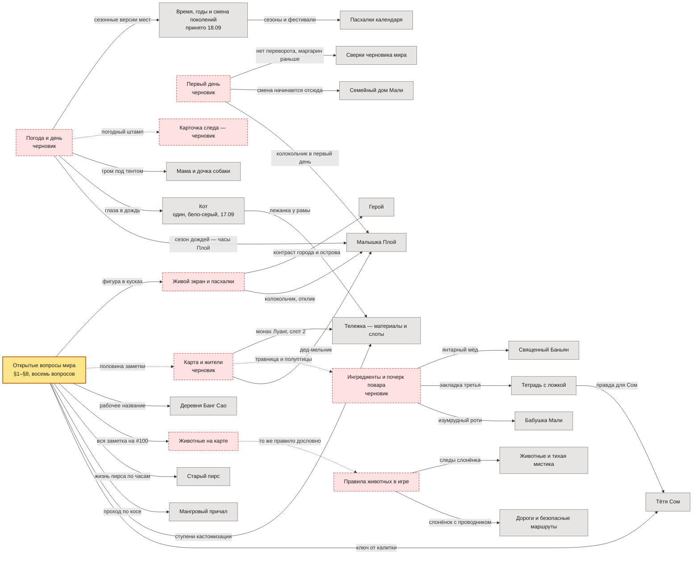

# На чём это стоит

> Эта заметка ничего не утверждает о мире и ничего не дублирует. Она показывает только одно:
> какой текст перепишется, если владелица решит открытый вопрос иначе. Факты живут в своих
> заметках — здесь на них лишь ссылаются.

Читать слева направо: слева то, что **ещё не решено**, справа — заметки, которые на этом стоят.
Подпись на стрелке — то самое, что придётся переписывать. Пунктир — опора сама неподтверждённая
(песок на песке).

## Что из этого следует

- **Самая нагруженная опора — «Открытые вопросы мира»:** на ней стоят восемь заметок, включая
  два места и начало игры. Это не персонаж и не предмет, а нерешённое.
- **Песок на песке — три случая:** «Карта и жители» держит «Ингредиенты», а сама стоит на #100;
  «Животные на карте» держат «Правила животных», а сами объявляют себя гипотезой; «Карточка следа»
  стоит на черновике погоды. Пунктирные стрелки.
- **Уже сработало один раз.** Слот тележки написан под трёхцветного кота, которого отменили решением
  17.09 «кот один, бело-серый». Ребро `Кот → Тележка` — это не прогноз, а невыполненная правка.
- **Единственная принятая заметка на черновике:** «Время, годы и смена поколений» (✅ 18.09)
  наполовину стоит на черновике погоды.

## Чего здесь нет

- Решений и их дат — они в `docs/decisions-log.md`, у них свой дом.
- Самих фактов — они в своих заметках; здесь только имена и то, что перепишется.
- Ассоциаций «кто с кем знаком»: связи между людьми и местами тут не зависимость, и их на схеме нет.

---

*Собрано 19.09.2026 разбором всех 29 заметок. Схема правится строкой: закрылся вопрос — убрать стрелку.*
