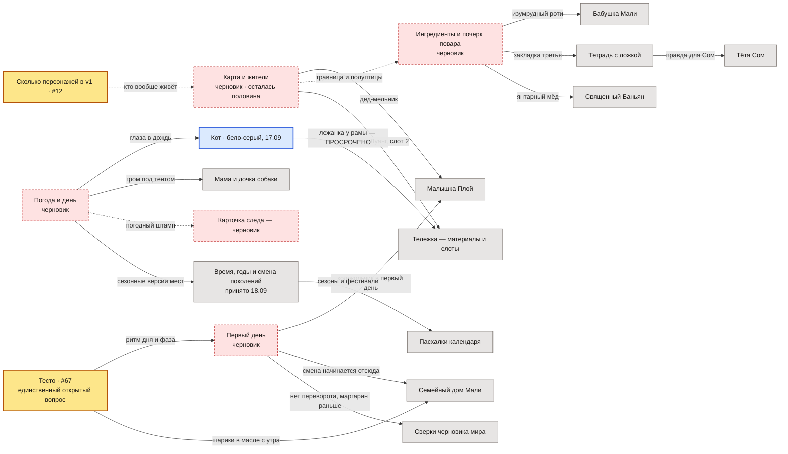

# На чём это стоит

> Эта заметка ничего не утверждает о мире и ничего не дублирует. Она показывает только одно:
> какой текст перепишется, если открытый вопрос решить иначе. Факты живут в своих заметках —
> здесь на них лишь ссылаются.

**19.09.2026: схема похудела вдвое.** Было 30 зависимостей, осталось 18. Двенадцать ушли не потому,
что текст изменился, а потому что вопросы, на которых он стоял, закрыты — восемь параграфов
[[Открытые вопросы мира]] решены за один заход. Ушёл целиком самый нагруженный узел: «Открытые вопросы
мира» держали восемь заметок, теперь ноль.

Читать слева направо: слева то, что **ещё не решено**, справа — заметки, которые на этом стоят.
Подпись на стрелке — то самое, что придётся переписывать. Пунктир — опора сама неподтверждённая
(песок на песке).

## Что из этого следует

- **Открытых вопросов о мире остался один — тесто (#67).** Всё остальное на схеме — не вопросы, а
  черновики: текст написан, но владелицей не подтверждён. Это разные вещи, и чинятся они по-разному.
- **Тесто оказалось не мелочью, а пружиной дня.** После решения 19.09 «фазу двигает то, что игрок сделал,
  а не переезд» именно заготовка теста стала счётчиком дня. Поэтому вопрос, выглядевший техническим,
  держит и начало игры, и ритм смены.
- **Погода больше не риск, а черновик.** Сезоны подтверждены владелицей 19.09, и часы Малышки Плой
  («мама обещала вернуться к сезону больших дождей») в безопасности. Осталось дописать сам черновик.
- **Один долг просрочен** (синий узел). Слот тележки написан под трёхцветного кота, которого отменило
  решение 17.09 «кот один, бело-серый», и под место у основания рамы, тогда как решение требует место
  выше уровня готовки. Это не прогноз — это невыполненная правка.
- **Второй технический долг:** из слота 2 тележки убрать гирлянду от монаха Луанга — решение 19.09
  снимает религиозный слой как механику, а сам монах заведён только в черновике карты и жителей.

## Что закрылось 19.09 и ушло со схемы

| было | держало | чем закрыто |
|---|---|---|
| §7 Карта и перемещение | 4 заметки прямо, 14 через цепочку | карта — экран выбора точки; это уже стояло в каноне в трёх местах |
| §5 Сезоны (#71) | часы Малышки Плой | сезоны будут (владелица) |
| §8 Форма повествования | Живой экран, Герой | руками написано всё, что говорит человек |
| §1 Как отсутствует Мали | ключ от калитки у Сом | уехала к родне, приезжает на праздники и просто так |
| §6 Изменение деревни | ступени кастомизации | равноценные состояния по дарителю (подтверждает #40) |
| §4 Название | заметка деревни | «Банг Сао» окончательно |
| §3 Культурная рамка | — | рамки у героя нет; монах без религиозных механик |

## Чего здесь нет

- Решений и их дат — они в `docs/decisions-log.md`, у них свой дом.
- Самих фактов — они в своих заметках; здесь только имена и то, что перепишется.
- Ассоциаций «кто с кем знаком»: связи между людьми и местами тут не зависимость, и их на схеме нет.

---

*Собрано 19.09.2026 разбором всех 29 заметок, обновлено после решений того же дня.
Схема правится строкой: закрылся вопрос — убрать стрелку.*
