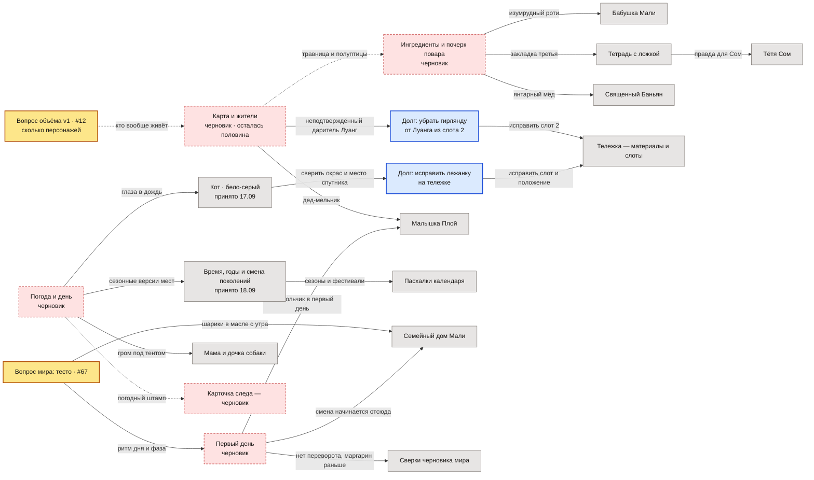

# На чём это стоит

[[00 Карта историй|Все виды]] · [[07 Виды/Решения и риски.canvas|Открыть короткий вид]]

> Это **карта влияния решений на документы**: что проверить или исправить, если основание изменится.
> Она не описывает обязательные зависимости игры, порядок разработки или знакомства персонажей.
> Факты живут в своих заметках, формулировки решений и их даты в `docs/decisions-log.md`.

**Представление открытой работы, 19.09.2026.** На схеме оставлены открытые вопросы, черновики,
невыполненные правки и заметки, через которые проходит их влияние. Принятые решения тоже могут
быть основаниями; их сохранённые связи собраны в таблице ниже. Закрытый вопрос перестаёт быть риском,
но **не перестаёт влиять на текст**.

### Легенда

- **Сплошная стрелка**: изменение источника требует сверить указанную часть целевой заметки.
  Сверить не всегда значит переписать; стрелка не задаёт порядок игровых действий.
- **Пунктирная стрелка**: предполагаемое влияние, которое ещё нужно подтвердить.
  Это не «необязательная механика», в отличие от пунктира в справке [[Связи механик]].
- **Жёлтый узел «вопрос»**: решение открыто. Вопрос мира #67 и оценка объёма v1 #12
  относятся к разным областям и не складываются в один счётчик «вопросов мира».
- **Красный пунктирный узел «черновик»**: основание не подтверждено целиком.
  Статус черновика не делает каждую исходящую связь предположительной.
- **Серый узел**: заметка или принятое основание; это не отметка готовности кода.
- **Синий узел «долг»**: конкретная невыполненная правка, а не персонаж или место.

Читать по направлению стрелки **основание → затронутый текст**, не по расположению слева/справа.
Цвет дублируется словами в статусных узлах. Эта легенда относится к Mermaid-схеме ниже, а не к
общему графу ссылок Obsidian.

## Что из этого следует

- **Из списка вопросов мира открыт #67 о тесте.** Рядом показан отдельный вопрос объёма v1
  [#12](https://github.com/newYurk/roti-stand/issues/12), а также черновики, принятые основания
  и долги. Их статусы различаются; «всё остальное не подтверждено» из схемы не следует.
- **Тесто оказалось не мелочью, а пружиной дня.** После решения 19.09 «фазу двигает то, что игрок сделал,
  а не переезд» именно заготовка теста стала счётчиком дня. Поэтому вопрос, выглядевший техническим,
  держит и начало игры, и ритм смены.
- **Сезоны приняты, описание погоды остаётся черновиком.** Принятое решение связано с часами
  Малышки Плой; принятие сезонности не утверждает автоматически каждую деталь погодной заметки.
- **Долг по лежанке просрочен** (синий узел). Слот тележки написан под трёхцветного кота, которого отменило
  решение 17.09 «кот один, бело-серый», и под место у основания рамы, тогда как решение требует место
  выше уровня готовки. Это не прогноз — это невыполненная правка.
- **Второй технический долг:** из слота 2 тележки убрать гирлянду от монаха Луанга — решение 19.09
  снимает религиозный слой как механику, а сам монах заведён только в черновике карты и жителей.

## Принятые решения: связи сохранены

«Принято» означает текущую рабочую договорённость, а не запрет на пересмотр. Владелица может
менять любое решение; связи нужны, чтобы при этом видеть последствия, а не ограничивать изменения.

Это не новый канон и не второй журнал решений. Таблица сохраняет **решение → затронутые заметки**
для повторной сверки, если решение будет пересмотрено; перечень влияний не претендует на полноту.
Содержание и даты проверять в [[Открытые вопросы мира]] и `docs/decisions-log.md`.

| Тема | Связанные заметки | Принятое основание для сверки |
|---|---|---|
| §7 Карта и перемещение | [[Карта точек]], [[Петля дня]] | Карта выбирает точку; переезд сам по себе не двигает фазу |
| §5 Сезоны (#71) | [[Погода и день — черновик]], [[Малышка Плой]], [[Время, годы и смена поколений]] | Сезоны будут; детали погоды проверяются отдельно |
| §8 Форма повествования | [[Живой экран и пасхалки]], [[Герой]] | Руками написано всё, что говорит человек |
| §1 Как отсутствует Мали | [[Бабушка Мали]], [[Тётя Сом]] | Уехала к родне, приезжает на праздники и просто так |
| §6 Изменение деревни | [[Тележка — материалы и слоты]], [[Тележка — музей отношений]] | Равноценные состояния по дарителю, не ступени «лучше» (#40) |
| §4 Название | [[Деревня Банг Сао]] | «Банг Сао» окончательно |
| §3 Культурная рамка | [[Герой]], [[Встреча и обмен]], [[Карта и жители — черновик]] | Рамки у героя нет; монах без религиозных механик |

### Как обновлять карту

1. Вопрос решён: отметить статус и сохранить его связи в таблице принятых решений.
   Из представления открытой работы можно убрать вопрос, **из карты влияния связь не удалять**.
2. Решение пересмотрено: вернуть вопрос в открытую работу и сверить связанные заметки.
   Старое решение не переписывать задним числом; его история остаётся в журнале.
3. Долг выполнен: отметить выполнение со ссылкой на правку; затем убрать синий узел из открытой работы.
4. Влияние опровергнуто: удалить или заменить связь с объяснением. Закрытие issue само по себе
   не доказывает, что связь исчезла.

## Чего здесь нет

- Полных формулировок решений и их истории: они в `docs/decisions-log.md`, у них свой дом.
- Самих фактов — они в своих заметках; здесь только имена и то, что перепишется.
- Ассоциаций «кто с кем знаком»: связи между людьми и местами тут не зависимость, и их на схеме нет.

---

Собрано 19.09.2026; смысл связей и легенда уточнены в тот же день. Исправления обозначений
не меняют сами истории, решения мира или правила готовки.
