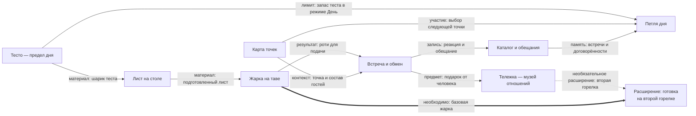

# Связи механик

[[00 Карта историй|Все виды]] · [[07 Виды/Игровая петля.canvas|Игровая петля]] · [[07 Виды/Зависимости.canvas|Зависимости]]

Справка о смысле связей, не стартовая страница и не счётчик готовности. Текущая работа живёт в
[STATE.md](https://github.com/newYurk/roti-stand/blob/codex/roti-continuation/STATE.md),
задачи в [GitHub Issues](https://github.com/newYurk/roti-stand/issues).

## Как это устроено

Это **обзор потоков между восемью механиками**, а не граф обязательных зависимостей и не порядок
разработки. Девятый узел отдельно показывает расширение: готовку на второй горелке.

Читать нужно **по подписи стрелки**, а не по соседству узлов:

- **Сплошная тонкая стрелка `→`**: материал, результат, контекст или участие в петле.
  Такая связь сама по себе не означает «без этого нельзя запустить».
- **Пунктирная стрелка `⇢`**: необязательное расширение. Вторая горелка расширяет готовку,
  но не открывает базовую жарку.
- **Толстая стрелка `⇒` с подписью «необходимо»**: обязательная предпосылка именно указанной
  возможности. Здесь базовая жарка нужна для её расширения, а не наоборот.

Имена механик соответствуют исходным заметкам; к ним ведут карточки досок. Размер и положение узла не показывают
готовность, стоимость реализации или приоритет.

Предмет от человека может расширить готовку: это прогресс через отношения, а не требование
получить подарок до первого роти. **Обратной обязательной связи «Тележка → базовая жарка» нет.**

Связь «Тесто → Лист» обозначает материал, не ожидание новой партии. **v0/Zen не требует петли дня,
карты, гостей или реального восполнения теста**; обзор показывает и будущий режим День.
Каталог хранит память, но не завершает день: невыполненное обещание не блокирует игру.
Карта участвует в выборе точек, а не является условием каждой встречи: первый день проходит у дома.

### Что означает граф ссылок Obsidian

Встроенный Graph View показывает другое: **заметка → заметка, на которую она ссылается**.
Его стрелка не означает «причина → следствие» или «условие → зависимая механика», а размер узла
отражает число ссылающихся заметок, не важность системы
([Obsidian: Graph view](https://obsidian.md/help/plugins/graph)).
Цветовые группы нашего графа различают папки, не статус канона или готовность кода.

Смысл межсистемных ссылок записан в свойствах карточек механик. Свойство читается
**от текущей заметки к указанной**; поэтому `материал-из: [[Лист на столе]]` у жарки
ссылается в обратную сторону относительно потока материала `Лист → Жарка` на схеме выше.
Это разные представления, не противоречие.

| Свойство текущей заметки | Как читать ссылку |
|---|---|
| `материал-из` | Получает материал от указанной механики; не наследует её ограничения режима День |
| `блюдо-из` | Получает приготовленное блюдо для подачи |
| `контекст-из` | Использует контекст места и гостей; не обязательный шаг для каждой встречи |
| `записи-из` | Получает сведения для памяти, не обязательное условие существования всего каталога |
| `предметы-из` | Получает предметы через отношения и обмен |
| `расширения-из` | Получает необязательные расширения; базовая возможность доступна без них |
| `лимит-из` | Берёт ограничение режима День; правило его восполнения остаётся вопросом #67 |
| `выбор-точки-через` | Использует экран выбора точки, когда он доступен |
| `память-в` | Хранит сведения о дне в указанной системе; не условие окончания дня |

Это обычные списковые свойства с внутренними ссылками, не новая настройка плагина
([Obsidian: Properties](https://help.obsidian.md/properties)).
Graph View не получает из них отдельную легенду типов рёбер: смысл читается здесь, в свойствах
заметки и в подписанной Mermaid-схеме. Цикл обычных ссылок не доказывает цикл обязательных зависимостей.
Список свойств описывает показанные связи, но не является полным контрактом всех входов каждой системы.

[[На чём это стоит]] отвечает на отдельный вопрос: какие тексты проверить при изменении решения.
Её связи влияния нельзя читать ни как порядок действий игрока, ни как обязательные зависимости игры.

## Где продолжить

Состав и готовность каждой механики живут в её собственной заметке, не дублируются счётчиком здесь.
Для навигации есть [[07 Виды/Игровая петля.canvas|доска петли]], для открытой работы
[[07 Виды/Решения и риски.canvas|доска решений]]; подробная карта влияния остаётся в [[На чём это стоит]].

Все представления рабочие. Если решение меняется, сверяем затронутые заметки и обновляем связи,
а не объявляем прежнюю схему неизменным устройством игры.
