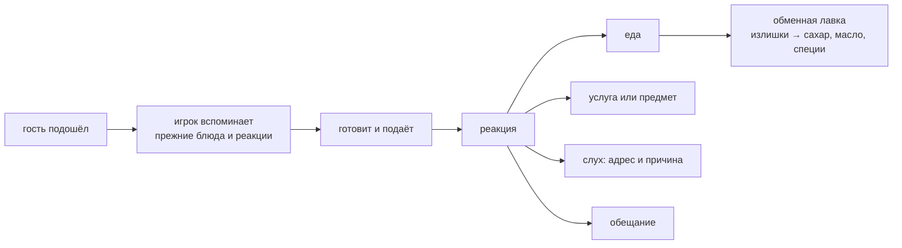

---
блюдо-из:
  - "[[Жарка на таве]]"
контекст-из:
  - "[[Карта точек]]"
---
# Встреча и обмен

Монет, ценников и кошелька в игре нет. Гость отвечает тем, что может дать: едой, услугой, слухом,
обещанием, редким предметом или новой встречей. Роти — язык деревни и основа обмена.

**Направление 19.09: [[Бессловесные встречи]].** Основной смысл передаётся действиями, предметами,
жестами и реакциями без обязательного чтения. «Слух», «рассказ» и «обещание» в этой заметке
обозначают смысл, не обязательный текст диалога. Конкретные сцены ещё предстоит адаптировать.

**Черновик 22.09:** до подхода гостя мир может давать [[Атмосферные намёки на гостя — черновик|атмосферные намёки]]
(силуэт, чайка, море, точка на карте) — мягкий прогноз, не гарантия и не мини-игра на угадывание.

## Каталог: кто что даёт

| Кто | Что может дать | Чего хочет | Состояние |
|---|---|---|---|
| Мельник | муку | пара роти в неделю; со временем грубый помол для хрустящих краёв | **под фактчеком:** тайская деревенская мельница — рисовая (โรงสี), пшеничная мука покупная; кто источник муки, решается по фактчеку, а не по таблице |
| Соседка с курами | яйца | завтрак мужу, который уходит рано | канон; владелица 17.09 допускает и свой курятник у героя — что из двух, не решено |
| Рыбак | рыбу | сытный роти после возвращения с воды | канон; [[Дядюшка Чат]] |
| Рисовая семья | рис, кокос | еду в особенно тяжёлый день | канон |
| Дети | камешки, рисунки, слухи | сладкий роти или добрый жест | канон; [[Малышка Плой]] |
| Монах | благословение, редкую траву | простую еду без лишнего | **урезано 19.09:** тихий завсегдатай, любит простую еду; религиозных правил как механики нет — ни подаяния как сцены, ни «постного роти до полудня» |
| Путник | новую специю, какао, рассказ | неожиданную смесь или внимание | канон |
| Обменная лавка | сахар, масло, сгущёнку, специи | излишки | канон; место, где «много» превращается в «не хватает» |

Постоянных персонажей в v1 — шесть плюс два редких гостя. Заведено семь карточек
в `01 Люди`, и две из них — животные ([[Кот]], [[Мама и дочка собаки]]); кода нет ни у одного.

## Чем ограничена

- **Кода нет вовсе.** Ни гостя, ни реакции, ни обмена: стенд заканчивается карточкой следа.
- Персонажи — **самая дорогая статья корпуса** по ревью: 842 кадра против 479 у всей готовки.
  Резать в первую очередь их число, не карту.
- Таблица выше — состав соседей, а не фактчек: мельник, монах и окна школы и пристани проверяются
  линзой F1 до v1 (#13).
- Скрытых вкусов списком игрок не видит и шкалы «узнавания» нет: знание о людях — сток коллекции,
  см. [[Каталог и обещания]].
- **Смысловые сцены и реакции авторские** (уточнение 19.09): бессловесная форма не вводит
  генерацию намерений и сюжета на лету. Прежнее правило «всё, что говорит человек, написано руками»
  больше не следует читать как требование словесных диалогов.
- **Пропустить можно всё, что про человека:** ни одна тайна не лежит на обязательном пути.
  Упущенное возвращают два с половиной моста — обещание в каталоге, предмет на тележке и
  повторяемое условие места.
- Герой — брат и сестра, выбор на старте (#98); как переключаться между ними и где граница
  повторения встреч и реакций — [#107](https://github.com/newYurk/roti-stand/issues/107).
