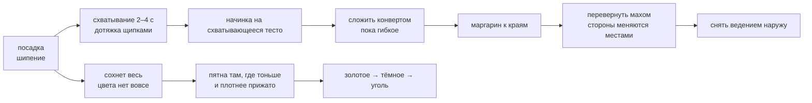

---
материал-из:
  - "[[Лист на столе]]"
расширения-из:
  - "[[Тележка — музей отношений]]"
---
# Жарка на таве

На вогнутой кратхе `กระทะโรตี` **палец = лопатка**: интерфейса нет, все жесты жарки — той же семьи
«поднять и шлёпнуть». Готовность ведёт звук, а не процент.

## Каталог: что в жарке уже есть

| Строка | Что это | Состояние |
|---|---|---|
| Модель прожарки | `heat = pan(r) × oil(r,fat) × contact × cover`; `cook` растёт только после `dry = 1` | **в стенде** |
| Две стороны | у каждой поверхности своя сушка и цвет; цвет — только у прижатой к стали | **в стенде (ветка)** |
| Схватывание | окно 2–4 с после посадки; `set = mean(dry) > 0,25` | в модели есть; как запрет на растяжку — нет |
| Дотяжка щипками на таве | вариант A, принят **условно**: вернёт «липкость» — снимается (#19) | **нет в стенде** |
| Пузыри | купола на тонких целых местах; рядом с дыркой не растут; прижал — пшикнуло | **в стенде (ветка)**, садятся случайно; где именно садятся — источниками не решено |
| Маргарин | кусок у борта, круговой мах по краю; край с жиром хрустит, без жира бледный | **в стенде (ветка)**; в v0 бесконечный, в v1 — ресурс дня с обменной лавки |
| Переворот | резкий мах, лист летит с поворотом; доступен всегда, обязателен конверту | **в стенде (ветка)**, одна фаза; двухфазный «подсунуть → перевернуть» — следующая итерация |
| Прижим удержанием | плющит, лопает пузыри, ускоряет контакт | описан; отдельного жеста в стенде нет |
| Прожарка до угля | сырое → золотистое → коричневое → тёмное → чёрное; невидимого потолка нет | **в стенде** |
| Готовность на слух | шипение глохнет, потрескивание учащается, спектр уезжает вверх | шипение и треск есть; **замер «снимать» в трёх условиях не проводился (#14)** |
| Снять | ведение наружу на стол, перелёт 0,35 с; отдельной доски нет | **в стенде (ветка)** |
| Время одного роти | 30–60 с реального времени; в стенде 40 / 60 / 85 с при цвете ×6 / ×3,5 / ×2 | **в стенде**, множители — условность, не физика |

Откуда начинает (фактчек 26.08 с перепроверкой): **не из центра**. Сначала лист сохнет весь и цвета
нет вовсе, потом цвет идёт пятнами там, где тоньше и плотнее прижато, — не градиент.

## Чем ограничена

- **Конверта как состояния нет ни в одной копии модели:** ни геометрии сложенного листа, ни поля
  «слой», ни правила, чему равен `contact` у двух соприкасающихся поверхностей. Прямо признано
  невозможным на нынешней сетке (#20).
- **Начинки как вещества нет:** только множитель `cover`. Ни количества, ни растекания яйца, ни
  поведения при перевороте.
- **Температуры не хранит никто:** все три копии считают мгновенный поток `heat`, состояния плиты нет.
- **Хруст назван целью шага 6, но величины не имеет** ни в одной копии.
- Бюджет 30–60 с откалиброван под упрощённые шаги 3 и 6; на начинку, конверт и переворот времени
  в нём нет.
- Порядок цвета конверта в стенде («база → клапаны») **обратен** тому, что написан в спецификации;
  сам тот порядок источниками не подтверждён.
- Звукового прототипа нет ни в проекте, ни в плане, хотя ревью предлагало сделать его раньше арта —
  он арт-нейтрален.
