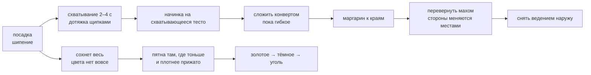

---
материал-из:
  - "[[Лист на столе]]"
расширения-из:
  - "[[Тележка — музей отношений]]"
---
# Жарка на таве

На вогнутой кратхе `กระทะโรตี` **палец = лопатка**: интерфейса нет, все жесты жарки — той же семьи
«поднять и шлёпнуть». Готовность ведёт звук, а не процент.

## Каталог: что в жарке уже есть

| Строка | Что это | Состояние |
|---|---|---|
| Модель прожарки | `heat = pan(r) × oil(r,fat) × contact × cover`; `cook` растёт только после `dry = 1` | **в стенде** |
| Две стороны | у каждой поверхности своя сушка и цвет; цвет — только у прижатой к стали | **в стенде (ветка)** |
| Схватывание | окно 2–4 с после посадки; `set = mean(dry) > 0,25` | в модели есть; как запрет на растяжку — нет |
| Дотяжка щипками на таве | вариант A, принят **условно**: вернёт «липкость» — снимается (#19) | **нет в стенде** |
| Пузыри | купола на тонких целых местах; рядом с дыркой не растут; прижал — пшикнуло | **в стенде (ветка)**, садятся случайно; где именно садятся — источниками не решено |
| Маргарин | кусок у борта, круговой мах по краю; край с жиром хрустит, без жира бледный | **в стенде (ветка)**; в v0 бесконечный, в v1 — ресурс дня с обменной лавки |
| Переворот | резкий мах, лист летит с поворотом; доступен всегда, обязателен конверту | **в стенде (ветка)**, одна фаза; двухфазный «подсунуть → перевернуть» — следующая итерация |
| Прижим удержанием | плющит, лопает пузыри, ускоряет контакт | описан; отдельного жеста в стенде нет |
| Прожарка | три ступени: сырое → приготовленное → зажаренное; угля нет | **решено 20.09**; в стенде ещё шкала до угля |
| Готовность на слух | шипение глохнет, потрескивание учащается, спектр уезжает вверх | шипение и треск есть; **замер «снимать» в трёх условиях не проводился (#14)** |
| Снять | ведение наружу на стол, перелёт 0,35 с; отдельной доски нет | **в стенде (ветка)** |
| Время на таве | **три минуты потолок**; дальше остаётся зажаренным | **решено 20.09**; в стенде пока 40 / 60 / 85 с |

Откуда начинает (фактчек 26.08 с перепроверкой): **не из центра**. Сначала лист сохнет весь и цвета
нет вовсе, потом цвет идёт пятнами там, где тоньше и плотнее прижато, — не градиент.

## Часы: три минуты (владелица, 20.09.2026)

Жарку ещё не делаем — жест идёт по шагам. Пока не забылось: **игровое время на таве — три минуты,
три ступени, дальше не жжётся.**

| Минута | Как называется | Что это |
|---|---|---|
| 1 | довольно сырое | ещё можно класть начинку; от масла и количества начинки **за эту минуту** решается, как быстро прыгнем дальше |
| 2 | хорошо приготовленное | нормальный роти |
| 3 и дальше | хорошо зажаренное | хруст, тёмные пятна. Держать хоть пять минут — **остаётся этим**, не углём |

Переход **отмечается** (звук / вспышка / след в карточке — как именно, когда дойдём до жарки). Это прыжок ступени, не ползунок.

Масло и начинка крутят **скорость прыжка**, не названия ступеней. Зависимости «положили на первой минуте / на второй» — много; расписать, когда будем жарить. Сейчас достаточно: первая минута задаёт темп, вторая не открывает четвёртую ступень.

Потолок видимый: игрок видит «зажаренное» и оно стоит. Это не невидимая стена и не «до угля без конца» (старая строка каталога, 20.09 снята).

В стенде цвет пока 40 / 60 / 85 с — проба, не эти часы.

## Чем ограничена

- **Конверта как состояния нет ни в одной копии модели:** ни геометрии сложенного листа, ни поля
  «слой», ни правила, чему равен `contact` у двух соприкасающихся поверхностей. Прямо признано
  невозможным на нынешней сетке (#20).
- **Начинки как вещества нет:** только множитель `cover`. Ни количества, ни растекания яйца, ни
  поведения при перевороте.
- **Температуры не хранит никто:** все три копии считают мгновенный поток `heat`, состояния плиты нет.
- **Хруст назван целью шага 6, но величины не имеет** ни в одной копии.
- Бюджет 30–60 с был под упрощённые шаги 3 и 6. **20.09 владелица заменила его на три минуты и три ступени** (см. выше). Старый множитель стенда не выкидываем, пока жарку не трогаем.
- Порядок цвета конверта в стенде («база → клапаны») **обратен** тому, что написан в спецификации;
  сам тот порядок источниками не подтверждён.
- Звукового прототипа нет ни в проекте, ни в плане, хотя ревью предлагало сделать его раньше арта —
  он арт-нейтрален.
