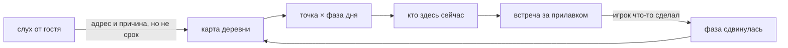

# Карта точек

Карта — **экран выбора точки**, а не улица, по которой ездят. У каждой точки своё окно и свой состав
гостей; фазу двигает то, что игрок сделал, а не факт переезда.

## Каталог: точки

| Точка | Где числится | Состояние |
|---|---|---|
| Дом | «утро дома» в петле дня; [[Семейный дом Мали]] | канон, есть и в семи точках, и в пяти точках v1 |
| Обменная лавка | меняет излишки на сахар, масло, сгущёнку, специи | канон, в v1 |
| Школа | звонок задаёт окно времени; [[Малышка Плой]] | канон, в v1; расписание — фактчек F1 |
| Храм | фоновая деталь места, не ритуал героя | канон, в v1 |
| Вечерний рынок | сумеречный хор цикад — звонок открытия в свой сезон | канон, в v1 |
| Рынок | в семи точках канона, в пять точек v1 не вошёл | канон |
| Пристань | возвращение лодок задаёт окно; [[Старый пирс]], [[Дядюшка Чат]] | канон; в v1 не вошла |
| Мангровый причал | **снят 19.09.2026**: текст мира, не точка | прилив как система отпал вместе с ним; сцены переселены на Старый пирс |

Экраны локаций: пять одобренных картинок в `mockups/locations/`, две из них уже живут под стендом
как рамы (`?frame=riverside`, `?frame=canal`).

## Чем ограничена

- **Кода нет.** Ни карты, ни выбора точки, ни фаз — только текст и картинки.
- Чем исключена одновременность точек после снятия бюджета минут — открыто (#67).
  Формулировка владелицы: «хотел успеть к школе и время ушло — ждёшь следующего дня».
- Какие реальные ограничения географии — паромы, отлив, сезон дождей — должны давить на карту,
  не решалось: [#100](https://github.com/newYurk/roti-stand/issues/100) отложен владелицей 18.09.
- **Названное место появляется на карте навсегда.** Фаза меняет, кто там сейчас, и никогда — можно
  ли прийти: окно, мимо которого пролетаешь, было бы наказанием за то, что игрок занимался людьми,
  а не расписанием.
- Гости, расписанные по часам суток в [[Погода и день — черновик]], — это ответ на ещё открытый
  вопрос (#63), а не принятое расписание.
- Первый день карту не открывает: он проходит у дома (владелица 17.09).
- Решение 19.09 сняло с [[Животные на карте]] оговорку «вся заметка — гипотеза на #100», а с ней
  разморозило [[Правила животных в игре]], [[Дороги и безопасные маршруты]],
  [[Животные и тихая мистика]] и половину [[Карта и жители — черновик]]. Самая большая разморозка
  за нулевую цену — и заодно повод дочитать эти четыре заметки.

## Новая идея, ещё не правило

Личный вид карты и деталей мест обсуждается в [[Личный мир — варианты и переходы]].
Это не утверждает процедурную географию, новые точки или отдельное сохранение для каждого
варианта оформления; условия перемещения по-прежнему остаются отдельным вопросом #100.
