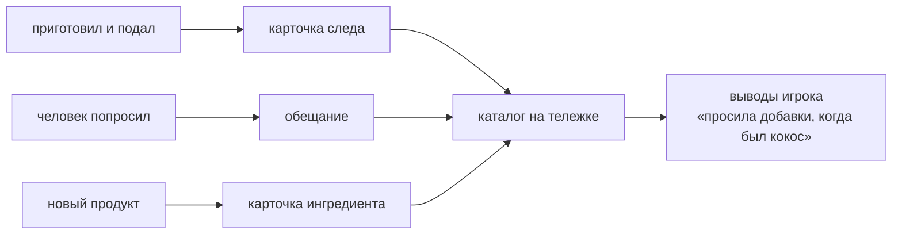

---
записи-из:
  - "[[Встреча и обмен]]"
---
# Каталог и обещания

Каталог лежит на тележке и держит всё, что игрок узнал. Это память дня — не журнал квестов
с галочками, а следы блюд и человеческие договорённости.

## Каталог: три вида знаний

| Страница | Что в ней | Состояние |
|---|---|---|
| Ингредиенты | что это за продукт и как он ведёт себя на сковороде | описано, кода нет |
| Следы роти | начинка, тесто, погода, внешний вид, кто ел и как отреагировал | **состав карточки открыт** ([#50](https://github.com/newYurk/roti-stand/issues/50)): владелица 07.09 — «механизм сохраняется, список пуст» |
| Обещания | короткие человеческие договорённости | описано, кода нет |

Эскиз карточки следа — четыре поля в [[Карточка следа — черновик]]: акварельный скетч, анатомия среза,
погодный штамп, след гостя. Это эскиз, который поможет карточку нарисовать, а не решение о составе.

Обещания из дизайн-дока: «Мельнику — 2 роти до пятницы» · «Мужу куриной тёти — завтрак рано утром» ·
~~«Монаху — простой роти в день поста»~~ — снято 19.09 вместе с религиозными правилами как механикой.

В стенде карточка есть в виде **черновика-заглушки**: кнопка «подать» → карточка → «следующий роти».
Это конец v0, а не работающий каталог.

## Чем ограничена

- **Обещание несёт повод, а не срок** (19.09.2026). Оно не истекает, не портится и не краснеет —
  иначе это журнал квестов под другим именем, который дизайн-док перечисляет в «Чего в игре нет».
- **Невыполненное обещание не блокирует игру:** человек даст в долг, напомнит, принесёт меньше или
  предложит иной обмен. Долг — повод вернуться к человеку, а не штраф.
- **Никакой шкалы «узнавания» нет.** Скрытые вкусы списком не показываются: игрок делает выводы
  из карточек.
- Фиксируется каждое блюдо, каким бы дорогим ни был путь к нему (в корпусе и ревью это «паспорт роти» —
  то же самое).
- Чем приходится каталогу [[Тетрадь с ложкой]] — оболочкой или самостоятельным предметом — **не решено**,
  но и не решается молча (19.09).
- «Реальная толщина слоёв» в эскизе карточки условна: в стенде миллиметры настоящие, а рисунок
  преувеличен вдвое.
