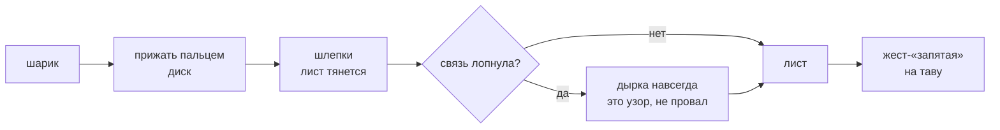

---
опирается-на:
  - "[[Тесто — предел дня]]"
---
# Лист на столе

Руками превратить комок в тонкую золотистую вещь: расплющить, растянуть шлепками, перенести на таву.
Единица ввода — **шлепок (ฟาด)**, не непрерывная тяга: взять, поднять, шлёпнуть.

## Каталог: что умеет стол

| Строка | Что это | Состояние |
|---|---|---|
| Расплющить прижатым пальцем | шаг 1 | **в стенде** |
| Растянуть шлепками до листа | шаг 2; ритм вместо волочения, звук счётный | **в стенде** |
| Разрыв — узор, не провал | дырка навсегда, переделать нельзя, предупреждения нет | в стенде есть, но **недостижим**: потолок площади 125 % останавливает лист раньше порога разрыва |
| Звуки листа | скрип натяжения, шлепок удара, сухой треск новой дырки | в стенде шипение и треск; звукового прототипа в проекте нет |
| Перенос жестом-«запятая» | рука → полёт с поворотом → посадка → шипение | **в стенде**; калибровка дуги на живом iPhone — #1 |
| Слои (самоналожение) | одна инвестиция, открывающая и конверт, и песочницу | в стенде **плоская геометрия слоёв**, не 3D-самоконтакт (#20) |
| Складка внутрь | коснуться кромки и потянуть внутрь; линия сгиба — серединный перпендикуляр | **в стенде**, ручная |
| Нарезка свободная | направление, длину и число резов выбирает игрок; торец со слоями | **в стенде** |
| Песочница: два листа, трубка, рулет, тройная начинка | «ого, так можно?!» — следствия единых правил, не сценарные исключения | **задумано**; в стенде один лист |
| Раскладка стола | зеркалится под руку при первом запуске и дальше не меняется | решено, в стенде не зеркалится |

Уличный канон один и фиксирован: стол — только для растяжки, начинка и складывание — на сковороде.

## Чем ограничена

- **«Лист плоский» — допущение, а не решение** (#34 отложен): тесто моделируется картой толщины
  по узлам, слои — самоналожение, а не объём.
- **Инвариант уже нарушен:** «дырка навсегда» объявлена, но в стенде дырку почти не получить —
  невидимый потолок площади стоит там, где дизайн-док запрещает невидимые стены.
- Направление перекалибровки разрыва снято 08.09.2026 как ошибочное (#90): калибруется величина,
  а не направление; направление — игровая условность и решается как вопрос дизайна.
- Распознавание расплющивания и переноса владелица приняла 16.09 и **менять его без нового
  запроса нельзя** (#91).
- Черновик [[Ингредиенты и почерк повара — черновик]] предлагает каталог из четырёх названных складок —
  это спорит со свободной складкой в стенде.
