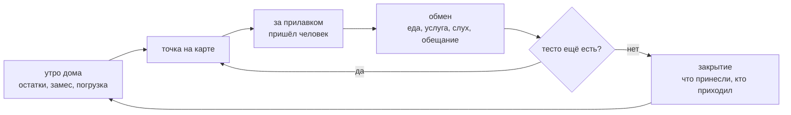

---
опирается-на:
  - "[[Тесто — предел дня]]"
  - "[[Карта точек]]"
  - "[[Каталог и обещания]]"
---
# Петля дня

Один день игры: утро дома → точка на карте → встречи за прилавком → закрытие. День кончается
не по часам, а когда кончилось тесто.

## Каталог: из чего состоит день

| Шаг петли | Что в нём происходит | Состояние |
|---|---|---|
| 1. Утро дома | смотрит остатки, решает, какое тесто замесить, грузит тележку | описано в каноне; сам замес не описан (#39) |
| 2. Маршрут | выбор следующей точки на карте | решено 19.09: карта — экран выбора точки |
| 3. Переход | ездить не нужно; звук дороги, не геймплей | решено; **чем оплачивается переход — открыто (#67)** |
| 4. Торговля | вспомнить прежние реакции, выбрать начинку, пожарить, подать | семь шагов готовки — [[Лист на столе]], [[Жарка на таве]] |
| 5. Обмен и отношения | гость отвечает не деньгами — [[Встреча и обмен]] | описано, кода нет |
| 6. Закрытие | вечером показывает, что принесли, что изменилось, кто приходил | описано; экрана нет |

Четыре вопроса, на которые игрок отвечает каждый день (дизайн-док, «Что выбирает игрок»):
где быть в это время · что взять на тележку · для кого готовить сегодня · какое обещание важнее.
Единственно правильного ответа нет; ошибка — новая история, а не проигрыш.

Режимы: **Zen** — готовка без дня, единственный режим v0; **День** — вся петля, с v1.

## Чем ограничена

- **Бюджета игровых минут нет** (снято 07.09.2026). Поездки, разговоры и готовка минут не тратят,
  курса «сколько минут стоит роти» не существует.
- **Фазу дня двигает то, что игрок сделал, а не факт переезда** (19.09.2026): переезд, оплачиваемый
  фазой, — это тот же бюджет минут в укрупнённом виде.
- **Чем теперь исключена одновременность точек — не решено.** Это и есть открытый вопрос
  [#67](https://github.com/newYurk/roti-stand/issues/67): носителем счётчика назначено тесто,
  но как именно — не выбрано.
- **Первый день проходит у дома, без поездки** (владелица 17.09): карта открывается позже —
  [[Первый день — черновик]].
- Давление создаёт не потеря еды, а упущенная встреча, короткий сезон или прошедший праздник.
