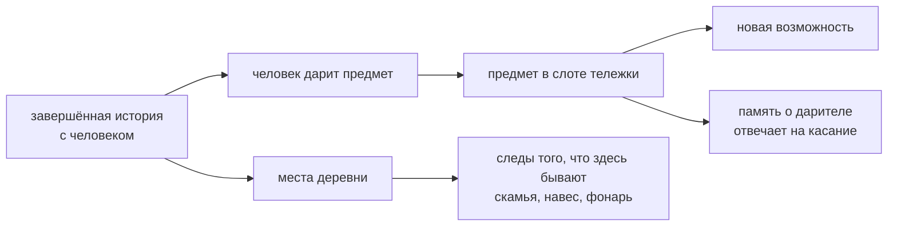

---
предметы-из:
  - "[[Встреча и обмен]]"
---
# Тележка — музей отношений

Улучшения не покупаются. К концу игры тележка — не набор купленных апгрейдов, а музей отношений:
зонт сшила швея, звонок подарили дети, вторую горелку починил мастер. Каждый предмет напоминает,
от кого он.

## Каталог: предметы и слоты

| Строка | Откуда | Состояние |
|---|---|---|
| Зонт от швеи | завершённая история | канон; позволяет торговать в дождь |
| Звонок от детей | завершённая история | канон; зовёт детей |
| Вторая горелка от старого мастера | завершённая история | канон; даёт готовить две основы |
| Складной столик от рыбака | завершённая история; [[Дядюшка Чат]] | канон |
| Медный колокольчик [[Малышка Плой]] | **детское исключение** (18.09): дарит в первый день, не дожидаясь завершённой линии | принято; он же первый предмет, отвечающий на касание (#103) |
| Слот 1 · ламбрекен тента | черновик [[Тележка — материалы и слоты]] | черновик; ступени «базовый → лучше → праздничный» **отменены 19.09** |
| Слот 2 · боковые стойки | там же | **технический долг:** убрать гирлянду Пхуанг Малай от монаха Луанга — монах заведён только в черновике карты, религиозных правил как механики нет |
| Слот 3 · подвесы под крышей | ветрячки, травы, фонарь; сдвиг пальцем, отклик на касание | черновик; согласуется с [[Живой экран и пасхалки]] |
| Слот 4 · стеллаж с посудой | селадоновые пиалы, графинчик, корзинка | черновик |
| Слот 5 · полотенце для рук | черновик | черновик |
| Слот 6 · рукояти лопаток | черновик | черновик |
| Лежанка у основания рамы | место для спутника в поездке | **технический долг просрочен:** написана под трёхцветного кота, которого отменило решение 17.09 («[[Кот]] один, бело-серый»), и под место у основания рамы, тогда как решение требует место выше уровня готовки |
| Складной столик Чата, колёса, вывеска | экстерьерные слоты | черновик |
| Места деревни | у точки появляются скамья, навес, фонарь, детские поделки | принято 17.09: растёт и тележка, и улица |

## Чем ограничена

- **Ступеней нет.** 19.09 решено: равноценные состояния по дарителю, а не «базовый → лучше →
  праздничный». К ступени нужен критерий «кто заслужил третью», то есть гринд. Праздничный тент —
  состояние на день, а не верхняя ступень.
- **«HUD готовки» из черновика спорит с правилом «интерфейса нет: только стол».**
- Слоты в черновике закреплены за левой и правой стойкой, а раскладка стола зеркалится под руку игрока.
- Материал рабочей поверхности назван в черновике тремя разными способами, и ни один не совпадает
  с одобренными экранами.
- Касание ничего не приносит: новые предметы появляются только от людей, покупок и уровней нет.
  Игрок переставляет подаренное.
- Оба технических долга названы в [[На чём это стоит]] и до сих пор не выполнены.
