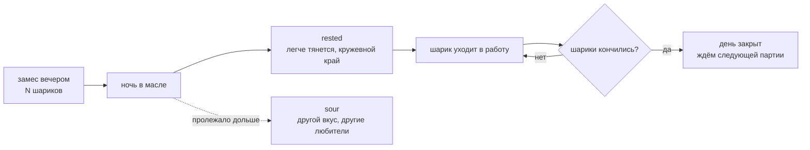

# Тесто — предел дня

Сколько шариков заготовил с вечера — столько роти за день и сделал. После снятия бюджета минут
это **единственный** предел дня: он ограничивает не длину дня, а число встреч.

## Каталог: что происходит с остатками

| Остаток | На следующий день | Состояние |
|---|---|---|
| Шарики теста | становятся `rested`: легче тянутся, тонкий кружевной край | канон; в стенде состояний теста нет |
| Старое отлежавшееся тесто | становится `sour`: другой вкус и другие любители | канон; модели нет |
| Целые ингредиенты | возвращаются в запас без изменений | канон |
| Нарезанные продукты | меняют свойства: банан мягче, кокос суше и хрустящее | канон |
| Готовый непроданный роти | ужин дома, угощение соседу или еда для пса | канон |

Принцип: **ничего не превращается в мусор.** Ингредиенты не гниют и не исчезают по таймеру —
у каждого состояния еды есть характер.

Заготовленное тесто может выходить неодинаковым — липче или суше; разброс это дня или выбор
игрока, владелица оставила открытым.

Индикатора не нужно: шарики лежат на столе, и «ресурс виден до того, как кончится» выполняется само
собой. Это и есть «интерфейса нет: только стол».

## Чем ограничена

- **Это единственный оставшийся открытый вопрос мира — [#67](https://github.com/newYurk/roti-stand/issues/67).**
  Одиннадцать из двенадцати закрыты 19.09.2026, этот остался. Формулировка владелицы: «надо, чтобы
  всегда можно было что-то приготовить, но заранее продумывать, сколько теста подготовила. А может
  быть, будем готовить утром».
- Три требования в натяжении: игра не запирает игрока · заготовка имеет вес · замес как ритуал начала дня.
- Решение 07.09.2026 (восполняется реальным временем, ориентир — следующие сутки) словами владелицы
  19.09 **мягко оспорено и ждёт пересмотра явно, а не молча**.
- Не выбрано, по каким часам идёт отсчёт: локальным, монотонным или серверным. Серверный вариант
  добавляет проекту сетевое требование, которого нет ни в одной оси рамки стека (#8).
- **Механика замеса не описана вовсе** (#39): в v0 её нет, в v1 это «утро дома».
- Что происходит с тестом в Zen-режиме — не решено.
