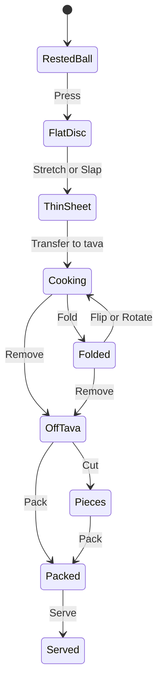
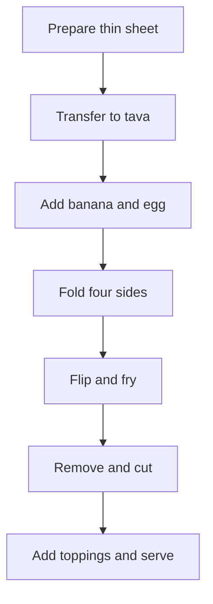

# Модель действий готовки — предложение по архитектуре

**Происхождение:** принесено владельцем 06.09.2026.
**Статус: предложение, не канон.** Это архитектурный разбор («я бы не делала отдельные классы»,
«следующий документ проекта я бы назвала Cooking Action Model»), а не принятое решение.
Что из него принимается — решает владелец; сверка и заведённые issues — в `docs/decisions-log.md`.
**Файл не редактируется** — как и всё в `docs/archive/`. Ниже текст дословно.

---

Это обычно описывают не одним линейным алгоритмом, а сочетанием нескольких вещей:

1. **Модель состояния мира** — где находятся тесто, ингредиенты и инструменты, что с ними физически произошло.
2. **Система действий** — что игрок может сделать прямо сейчас и при каких условиях.
3. **State machine / statechart** — крупные стадии приготовления и интерфейса.
4. **Рецепт или заказ** — желаемый результат, а не обязательная последовательность команд.
5. **Система оценки** — что получилось в результате действий игрока.

Главное решение для Roti Stand: **не записывать рецепт как жёсткую цепочку**:

> растянуть → перенести → положить банан → сложить → перевернуть.

Иначе любое отклонение придётся программировать отдельно. Лучше каждое действие разрешать или запрещать на основании текущего состояния предметов.

Например:

> Игрок может выполнить `Fold`, если тесто достаточно большое, ещё не затвердело и не разрезано.
> Неважно, лежит оно на столе или на таве. Но место выполнения изменит последствия.

### 1. Состояние самого роти

Один экземпляр теста можно представить приблизительно так:

| Группа            | Возможные значения                                  |
| ----------------- | --------------------------------------------------- |
| Форма             | `ball`, `disc`, `sheet`, `folded`, `roll`, `pieces` |
| Местонахождение   | `container`, `worktop`, `tava`, `tray`, `customer`  |
| Толщина           | Число или карта толщины                             |
| Размер            | Ширина и высота                                     |
| Целостность       | Дырки, разрывы, загнутые края                       |
| Слои              | Какие части теста лежат друг на друге               |
| Сторона           | Какая сторона соприкасается с тавой                 |
| Температура       | Числовое значение                                   |
| Влага             | От сырого до сухого                                 |
| Цвет              | От бледного до чёрного                              |
| Хруст             | Числовое значение                                   |
| Гибкость          | Насколько ещё можно растягивать и складывать        |
| Начинка           | Какие продукты добавлены                            |
| Положение начинки | Сверху, внутри, вытекает, выпала                    |
| Топпинги          | Сгущёнка, сахар, шоколад и прочее                   |
| Нарезка           | Не разрезано, линии разреза, количество кусочков    |

Получается не состояние `BANANA_ROTI_STEP_4`, а конкретный объект:

> Тонкий лист находится на таве, нижняя сторона подсохла на 40%, сверху лежит яйцо с бананом, края ещё гибкие, левый край уже сложен.

Это намного универсальнее.

### 2. Каталог действий

Каждое действие лучше описывать одинаковым набором полей.

| Поле              | Что означает                           |
| ----------------- | -------------------------------------- |
| `Action`          | Название действия                      |
| `Target`          | Над чем выполняется                    |
| `Tool`            | Нужен ли инструмент                    |
| `Preconditions`   | Когда действие доступно                |
| `Input`           | Какой жест делает игрок                |
| `Effects`         | Что меняется                           |
| `Duration`        | Мгновенное или продолжающееся действие |
| `Failure effects` | Что произойдёт при ошибке              |
| `Feedback`        | Звук, анимация, вибрация               |
| `Interruptible`   | Можно ли прервать действие             |

Начальный универсальный каталог Roti Stand:

| Действие      | Условия доступности                       | Основной результат                | Возможное плохое последствие           |
| ------------- | ----------------------------------------- | --------------------------------- | -------------------------------------- |
| `Take`        | Объект доступен руке                      | Объект взят                       | Уронить                                |
| `Place`       | Есть свободная поверхность                | Объект положен                    | Положить на грязное или горячее место  |
| `Press`       | Объект деформируемый                      | Уменьшается толщина               | Прилипание, раздавленная начинка       |
| `Stretch`     | Тесто достаточно гибкое                   | Увеличивается площадь             | Разрыв                                 |
| `Slap`        | Край теста поднят                         | Быстрое растягивание              | Дырка, складка                         |
| `Lift`        | Объект не прилип окончательно             | Отрыв от поверхности              | Разрыв                                 |
| `Transfer`    | Объект поднят                             | Меняется поверхность              | Смятый лист, промах                    |
| `Add`         | Продукт можно взять и есть доступная цель | Ингредиент оказывается на цели    | Слишком много, неправильное место      |
| `Spread`      | Начинка допускает распределение           | Меняется зона покрытия            | Выход за края                          |
| `Fold`        | Тесто целое и достаточно гибкое           | Создаётся новый слой              | Начинка остаётся снаружи или вытекает  |
| `Roll`        | Есть свободный край                       | Формируется рулет                 | Неравномерная толщина                  |
| `PressBubble` | Есть пузырь                               | Восстанавливается контакт с тавой | Прорыв теста                           |
| `Flip`        | Объект можно поддеть                      | Меняется контактная сторона       | Начинка выпадает                       |
| `Rotate`      | Объект лежит на поверхности               | Меняется зона нагрева             | Смещение начинки                       |
| `AdjustHeat`  | Горелка доступна                          | Меняется мощность нагрева         | Подгорание или слишком медленная жарка |
| `AddFat`      | Есть масло или маргарин                   | Усиливаются жарка и хруст         | Жирность, дым                          |
| `Remove`      | Объект можно поднять                      | Роти снимается с тавы             | Снять сырым или пережарить             |
| `Cut`         | Объект лежит на рабочей поверхности       | Создаются отдельные кусочки       | Неровные куски, вытекшая начинка       |
| `Drizzle`     | Есть жидкий топпинг                       | Появляется покрытие               | Перелить                               |
| `Sprinkle`    | Есть сыпучий топпинг                      | Добавляется сахар или специя      | Пересыпать                             |
| `Pack`        | Есть лоток или бумага                     | Роти подготовлено к подаче        | Часть кусочков не попала               |
| `Serve`       | Блюдо находится в лотке                   | Заказ завершён                    | Гость получает не то                   |
| `Discard`     | Объект существует                         | Объект удалён                     | Потеря продукта и времени              |
| `Clean`       | Поверхность загрязнена                    | Убираются остатки                 | Потеря времени                         |

Такой список кажется большим, но большинство действий универсальны. `Take`, `Place`, `Add`, `Fold`, `Flip` и `Cut` работают с десятками продуктов.

### 3. Не классы продуктов, а свойства и возможности

Я бы не делала отдельные классы вроде:

* `BananaRoti`;
* `EggRoti`;
* `ChocolateRoti`;
* `MangoRoti`.

Это быстро приведёт к дублированию логики. Лучше описывать продукты данными:

| Продукт        | Можно нарезать |       Можно разлить |        Можно жарить | Можно положить внутрь | Реакция на нагрев         |
| -------------- | -------------: | ------------------: | ------------------: | --------------------: | ------------------------- |
| Banana         |             Да |                 Нет |                  Да |                    Да | Мягче, слаще, темнеет     |
| Egg            |            Нет |                  Да |                  Да |                    Да | Схватывается              |
| Condensed milk |            Нет |                  Да | Да, но может гореть |                    Да | Карамелизуется            |
| Sugar          |            Нет | Нет, можно посыпать |                  Да |                    Да | Карамелизуется            |
| Chocolate      |        Условно |       После нагрева |                  Да |                    Да | Плавится                  |
| Dough          |             Да |                 Нет |                  Да |                Основа | Сушится, золотится, горит |

На уровне кода это называется **composition over inheritance**: объект получает набор компонентов или свойств, а не наследует всю логику от конкретного класса.

Например:

```text
Banana:
  tags: [solid, filling, sweet]
  capabilities: [slice, place, heat]
  heat_response: soften_and_caramelize

Egg:
  tags: [liquid, filling]
  capabilities: [pour, spread, heat]
  heat_response: coagulate

CondensedMilk:
  tags: [liquid, topping, sweet]
  capabilities: [drizzle, spread, heat]
  heat_response: caramelize_and_burn
```

Тогда действие `Add` проверяет не название продукта, а его свойства.

### 4. Recipe — не сценарий, а описание желаемого блюда

Заказ бабушки может выглядеть так:

```text
Requested:
  filling:
    banana: required
    egg: required
  shape: envelope
  doneness: golden
  edge_crispness: high
  topping:
    condensed_milk: medium
  cut: 9 pieces
```

Игрок может:

* положить банан до яйца;
* смешать их заранее;
* сначала положить яйцо;
* сложить конверт слишком рано;
* использовать двойное тесто;
* забыть сгущёнку;
* сделать шесть кусков вместо девяти;
* снять более тёмным;
* приготовить открытый роти вместо конверта.

Игра не запрещает эти действия. В конце система сравнивает получившийся объект с заказом и предпочтениями персонажа.

| Проверка                  | Возможная реакция                                 |
| ------------------------- | ------------------------------------------------- |
| Нужный состав             | «Да, именно банан!»                               |
| Желаемая степень прожарки | Бабушка любит особенно хрустящие края             |
| Форма                     | Конверт, рулет, открытый лист                     |
| Баланс начинки            | Мало, нормально, слишком много                    |
| Целостность               | Начинка удержалась или вытекла                    |
| Топпинг                   | Правильный вид и количество                       |
| История приготовления     | Уронено, пережарено, долго готовилось             |
| Личные предпочтения       | То, что нравится одному гостю, раздражает другого |

Это даёт возможность нарушать рецепт без отдельной ветки кода на каждое нарушение.

### 5. Какие графы нам действительно нужны

Один огромный граф всех комбинаций строить не стоит: он разрастётся до тысяч переходов. Нужны три более простых представления.

**Крупный statechart блюда:**



Этот граф показывает крупные состояния, но не запрещает добавлять ингредиенты в `ThinSheet`, `Cooking`, `Folded` или даже `Pieces`, если свойства ингредиента это позволяют.

**Граф доступности действий** генерируется автоматически:

```text
Текущее состояние
→ проверка Preconditions каждого действия
→ список доступных действий
→ жест игрока
→ Effects
→ новое состояние
```

**Граф рецепта** нужен только для обучения или подсказок:



Он показывает стандартный способ, но не управляет физикой игры.

### 6. Что должно управлять экраном

Интерфейс тоже должен смотреть на доступные действия.

Например:

* тесто лежит на столе — активны руки и масло;
* лист поднят — подсвечивается тава как возможная цель;
* лист оказался на таве — доступны начинка, складки, лопатка и огонь;
* появился пузырь — его можно прижать;
* роти снято — доступны резак, сгущёнка, сахар и лоток;
* роти упаковано — появляется действие подачи.

Игроку не обязательно показывать кнопки с названиями действий. Система нужна внутри игры, а игрок видит предметы и естественные жесты.

### 7. Что это означает для выбора стека

До выбора движка нам не требуется описать каждую комбинацию. Но нужен небольшой **исполняемый доменный прототип**:

* 15–20 универсальных действий;
* структура состояния одного роти;
* свойства пяти продуктов;
* предусловия и последствия;
* журнал выполненных действий;
* сохранение и воспроизведение состояния;
* стандартный заказ с бананом и яйцом;
* несколько намеренных нарушений последовательности.

После этого стеки можно сравнивать предметно:

| Требование                           | Что будем проверять                                           |
| ------------------------------------ | ------------------------------------------------------------- |
| Работа со слоями и деформацией теста | Насколько удобно хранить геометрию, складки и контакт         |
| Data-driven механики                 | Можно ли добавлять продукты и действия без переписывания кода |
| Statechart                           | Насколько удобно отлаживать состояния                         |
| Сенсорные жесты                      | Slap, transfer, fold, flip, drizzle                           |
| Детерминированность                  | Можно ли воспроизвести приготовление по журналу действий      |
| Сохранение                           | Можно ли сериализовать роти со всеми слоями и ингредиентами   |
| Производительность                   | Карта толщины, прожарки, контакта и жидкости                  |
| Инструменты отладки                  | Видны ли текущие свойства и доступные действия                |

Для QA здесь особенно полезен **action log**. Каждое приготовление можно сохранить как последовательность:

```text
00:03 Press(dough, position)
00:06 Slap(edge_2, force=0.71)
00:11 Transfer(dough, tava)
00:14 Add(egg, center, amount=0.8)
00:16 Add(banana, left_side, amount=1.2)
00:19 Fold(left_edge)
00:21 Flip(roti)
```

По такому журналу можно воспроизводить баги, строить автотесты и понимать, почему получился конкретный результат.

Следующий документ проекта я бы назвала **Cooking Action Model**. В нём нужны четыре таблицы:

1. объекты и их состояния;
2. универсальные действия;
3. предусловия и последствия действий;
4. параметры продуктов и инструментов.

А уже после него — statechart и короткий технический прототип для сравнения стеков.
