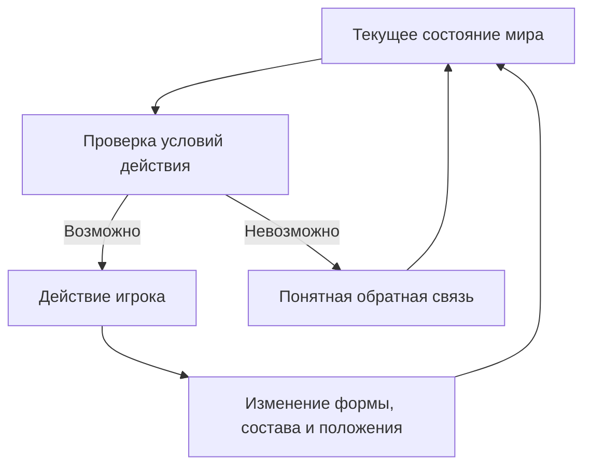

> **Происхождение:** принесено владельцем 07.09.2026, файл `roti-cooking-actions-input-stack.md`.
> **Статус: сводка обсуждения, не канон.** Документ сам себя так и объявляет: «не утверждает
> автоматически все предложения и не заменяет действующий дизайн-док». Что из него принято —
> в `docs/decisions-log.md`; заведённые задачи — в issues.
> **Файл не редактируется** — как и всё в `docs/archive/`. Ниже текст дословно.

---

# Roti Stand: готовка, действия, управление и выбор стека

Дата сборки: 7 сентября 2026 года.

## Границы и статус документа

Сводка обсуждения начиная с сообщения «Я сверила наш дизайн-док с описаниями тайского уличного роти» и до предварительной оценки выпуска на iPhone. Это тематически собранное обсуждение, а не дословная стенограмма. Включены вопросы пользователя, предложенные решения, состояние реализации, последующие исправления и открытые вопросы.

Документ не утверждает автоматически все предложения и не заменяет действующий дизайн-док. Статус кода относится к проверенной в разговоре ветке `main` репозитория `newYurk/roti-stand`; это снимок, а не постоянно обновляемый отчёт. Проверка исходников не равнозначна тестированию на устройстве.

Обозначения:

- ✅ Реализовано в стенде; живой тест отдельно указан там, где он был.
- 🧪 Частичная реализация или экспериментальная модель.
- 📐 Записано в действующем дизайне, но не обязательно реализовано.
- 🎨 Показано на концепт-арте, игровой механики это не подтверждает.
- ⬜ Не реализовано либо реализация не подтверждена.
- ⚠️ Предложение, противоречие или вопрос для проверки.

## 1. Реальная готовка: какую последовательность берём за основу

Для banana-and-egg roti в обсуждении принята следующая последовательность: отдохнувший шарик расплющивают и растягивают на смазанной маслом поверхности, переносят на горячую таву, дают листу немного схватиться, добавляют банан и яйцо, складывают конвертом, переворачивают и дожаривают с жиром. Готовое роти снимают, режут, добавляют сгущёнку и подают.

Это основа конкретного варианта роти, а не единственный допустимый тайский способ. У простого сладкого роти встречается складывание ещё на столе; форма, порядок отдельных операций и подача различаются. Рецепты для домашнего воспроизведения помогают понять технологию, но не доказывают, что все уличные продавцы действуют одинаково.

Источники, прочитанные в обсуждении:

- [Temple of Thai — Thai Street Vendor Style Roti](https://www.templeofthai.com/recipes/roti.php): подготовка теста, смазывание маслом, шлепки; на странице также есть ссылка на видео продавца. Текстовый рецепт включает вариант со сворачиванием теста в спираль.
- [Ian Benites — Thai Roti with Banana, Condensed Milk and Egg](https://ianbenites.com/thai-roti-with-banana-condensed-milk-and-egg/): подробно показаны перенос листа, добавление начинки, четыре складки на сковороде, переворот, жир, нарезка и подача. Это домашняя адаптация.
- [Leela Punyaratabandhu — Sweet Roti, Epicurious](https://www.epicurious.com/recipes/food/views/sweet-roti): различия формовки у продавцов Бангкока, вариант простого роти со складыванием до жарки.

Для нашей тележки сохраняем масляную рабочую поверхность без мучной пыли. Обмазанный маслом шарик не обязательно должен плавать в глубокой ёмкости масла. Способ укрытия и длительность отдыха различаются между рецептами.

### 1.1. Подготовка до смены

| № | Операция | Состояние проекта | Обсуждённое предложение |
|---|---|---|---|
| 0.1 | Смешать ингредиенты теста | 📐 «Утро дома», механики нет | За пределами v0 «одно роти» |
| 0.2 | Вымесить тесто | 📐 Упомянуто | Возможный короткий утренний ритуал |
| 0.3 | Разделить и скатать шарики | 📐 Шарик — исходное состояние | Выбор размера порций был предложен, не принят |
| 0.4 | Смазать шарики маслом, оставить отдыхать | 📐 Состояние `rested`, подробной механики нет | Делать до открытия тележки |
| 0.5 | Довести охлаждённое тесто до рабочей температуры | ⬜ Отдельной механики нет | Можно оставить за кадром |

### 1.2. Один заказ: операции и состояние реализации

| № | Операция | Возможное действие игрока | Состояние и остаток работы |
|---|---|---|---|
| 1 | Принять заказ | Подозвать гостя, прочитать просьбу | 🎨 Экран есть; игровой выбор и заказ не подтверждены реализацией |
| 2 | Взять шарик | Перенести из контейнера | 🎨 Изображение есть; выдача шарика не реализована |
| 3 | Смазать рабочее место при необходимости | Нанести масло | ⚠️ Решить: автоматически или отдельным жестом |
| 4 | Расплющить шарик | Прижать | ✅ Работает; в коде есть прижатие во времени |
| 5 | Растянуть лист | Поднять край и шлёпнуть | ✅ Работает; живой тест шлепкового ввода пройден |
| 6 | Управлять толщиной и разрывами | Выбирать следующие места захвата | 🧪 Модель есть, калибровка остаётся |
| 7 | Подготовить таву | Нагрев и жир | 🎨 Ползунок обсуждён и нарисован; полного управления нет |
| 8 | Перенести лист | Жест-«запятая» | ✅ Работает; нужны проверки удобства и порогов |
| 9 | Расправить загнутые края | Короткая дотяжка после посадки | 📐 Условное решение; живой тест не пройден |
| 10 | Дать листу схватиться | Следить за изменениями | 🧪 Сушка есть; игровое окно гибкости не завершено |
| 11 | Добавить начинку | Выложить банан и яйцо | 🎨 Ингредиенты есть; количества и размещения в игре нет |
| 12 | Сложить конверт | Завернуть четыре края | 📐 Описано; система слоёв не реализована |
| 13 | Добавить жир к краям | Круговое движение | 📐 Маргарин предусмотрен; интерактива нет |
| 14 | Жарить первую сторону | Ориентироваться на вид и звук | 🧪 Модель одной стороны есть |
| 15 | Прижать пузыри | Удержание в нужном месте | 📐 Решение принято; пузырей и прижима нет |
| 16 | Перевернуть | Поддеть и махнуть | 📐 Для конверта нужен переворот; в коде отсутствует |
| 17 | Дожарить вторую сторону | Следить за готовностью | ⬜ Двух сторон пока нет |
| 18 | Определить момент снятия | Слушать и смотреть | 🧪 Звук есть; сравнение «звук / картинка / оба» не проведено |
| 19 | Снять | Обратный перенос | 📐 Запланировано, не реализовано |
| 20 | Положить для нарезки | Перенести на свободный участок стола | 🎨 Обсуждалась металлическая поверхность без доски |
| 21 | Разрезать | Несколько движений резаком | 🎨 Есть концепт; механика и точный инструмент требуют проверки |
| 22 | Полить сгущёнкой | Вести бутылку | 📐 Предложен полив с инерцией, реализации нет |
| 23 | Посыпать сахаром | Дозировать топпинг | 📐 Упомянуто; не реализовано |
| 24 | Упаковать | Переложить в бумажный лоток | 🎨 Лоток есть; взаимодействия нет |
| 25 | Подать | Передвинуть блюдо посетителю | 📐 Подача и зубочистки предусмотрены; не реализовано |
| 26 | Подготовить стол к следующему заказу | Протереть поверхность | 🎨 Тряпка появлялась в арте; необходимость механики не решена |

Не все строки должны стать отдельными обязательными действиями. Ожидание, нагрев и изменение теста происходят одновременно с действиями игрока.

### 1.3. Важные уточнения по технологии

- Начинку добавляем на таве до превращения открытого листа в сухую хрустящую лепёшку.
- Упомянутые в дизайне 2–4 секунды для дотяжки — игровое допущение. В прочитанной домашней адаптации перед начинкой указано 15–30 секунд. Эти цифры нельзя считать одним подтверждённым тайским нормативом.
- В рецептах встречаются масло, гхи, сливочное масло; маргарин — выбранный продукт нашей модели, не обязательный для всех продавцов.
- Регулирование жара имеет технологический смысл, но непрерывное движение регулятора каждым продавцом не подтверждено. Предложение: выставить уровень и корректировать по необходимости.
- Нарезка на шесть или девять частей — один возможный способ подачи.
- Отдельная доска нежелательна по решению пользователя. В существующем тексте дизайна упоминание доски осталось; это противоречие нужно исправить отдельно.
- Прижим пузырей, звук готовности и штраф за длительный прижим следует считать нашими проверяемыми игровыми правилами, а не универсальными установленными особенностями всех уличных роти.

## 2. От рецепта к универсальной системе действий

Вопрос пользователя: как описать приготовление так, чтобы можно было менять порядок, складывать на столе или на таве, использовать разные продукты и затем обоснованно выбирать стек?

Предложена архитектура из пяти частей:

1. Состояние мира: где предметы, какова их форма, состав и температура.
2. Действия: условия доступности и последствия.
3. Состояния взаимодействия: захват, движение, отпускание, полёт.
4. Заказ или рецепт: желаемый результат и пример приготовления.
5. Реакция гостя: соответствие результата просьбе и личным предпочтениям.

Рецепт не должен быть единственным разрешённым маршрутом. Если край остаётся гибким, его можно попробовать сложить в разных местах; последствия зависят от состояния теста и поверхности.

### 2.1. Состояние роти

| Группа | Предложенные данные |
|---|---|
| Форма | Шарик, диск, лист, сложенный лист, рулет, кусочки |
| Местонахождение | Контейнер, стол, тава, лоток, у гостя |
| Геометрия | Размер, карта толщины, края, дырки и разрывы |
| Слои | Какие части перекрываются и какие соприкасаются |
| Нагрев | Температура, влага, прожарка обеих сторон |
| Текстура | Гибкость, сухость, хруст |
| Начинка | Продукт, количество, положение, внутри или снаружи |
| Топпинги | Состав, количество, распределение |
| Нарезка | Линии разрезов и получившиеся части |

Пример: «лист на таве; нижняя сторона подсохла; сверху яйцо с бананом; левый край сложен; остальные края ещё гибкие».

Форма, расположение и нагрев должны храниться независимо. Сложенное тесто одновременно может находиться на таве и продолжать жариться. Один перечислимый статус не описывает все эти свойства.

### 2.2. Паспорт действия

| Поле | Содержание |
|---|---|
| Action | Название действия |
| Target | Объект воздействия |
| Tool | Нужен ли инструмент |
| Preconditions | Условия, при которых действие возможно |
| Input | Жест или команда игрока |
| Effects | Изменения мира |
| Duration | Продолжительность |
| Failure effects | Последствия неудачной попытки |
| Feedback | Анимация, звук, возможная гаптика |
| Interruptible | Что происходит при прерывании |

Ошибка рецепта не обязана блокировать действие. Неподходящая начинка может попасть на тесто; слишком сухой край при попытке сложить может сломаться. Какие последствия моделируем — отдельные дизайнерские решения.

### 2.3. Обсуждённый каталог действий

| Действие | Условия / цель | Результат и возможное отклонение |
|---|---|---|
| Take | Доступный предмет | Взять; возможное падение — гипотеза |
| Place | Подходящая поверхность | Положить в выбранное место |
| Press | Деформируемый объект | Расплющить; потенциально раздавить начинку |
| Stretch | Гибкое тесто | Увеличить площадь; возможен разрыв |
| Slap | Захваченный край | Растянуть шлепком; изменить толщину |
| Lift | Доступный край | Приподнять; возможен разрыв |
| Transfer | Поднятый объект | Переместить между поверхностями |
| Add | Ингредиент и доступная цель | Добавить продукт в выбранном количестве |
| Spread | Распределяемая начинка | Изменить покрытие |
| Fold | Гибкий край | Образовать слой; оставить начинку снаружи |
| Roll | Доступный край | Сформировать рулет; пока предложение |
| PressBubble | Пузырь | Увеличить контакт с тавой |
| Flip | Объект можно поддеть | Поменять сторону; возможна потеря начинки |
| Rotate | Объект можно сдвинуть | Повернуть на поверхности |
| AdjustHeat | Регулятор горелки | Изменить мощность нагрева |
| AddFat | Источник жира | Изменить жирность и условия жарки |
| Remove | Объект можно поднять | Снять с тавы в выбранный момент |
| Cut | Резак и подходящая поверхность | Разделить на кусочки |
| Drizzle | Жидкий топпинг | Нанести струю |
| Sprinkle | Сыпучий топпинг | Посыпать |
| Pack | Лоток или бумага | Подготовить подачу |
| Serve | Блюдо и посетитель | Передать результат |
| Discard | Предмет | Убрать; правила расхода не утверждены |
| Clean | Загрязнённая поверхность | Очистить; отдельная механика не утверждена |

Это словарь кандидатов, а не 24 обязательные новые подсистемы. Take/Lift и Transfer/Remove могут использовать общий код; PressBubble может быть частным случаем Press.

### 2.4. Продукты: свойства вместо класса на каждый рецепт

Предложено хранить общие свойства продуктов и параметры реакций, избегая отдельных классов `BananaRoti`, `EggRoti`, `ChocolateRoti` для каждой комбинации.

| Продукт | Возможные операции | Предлагаемая реакция на нагрев |
|---|---|---|
| Банан | Нарезать, положить, нагреть | Размягчение и изменение цвета |
| Яйцо | Вылить, распределить, нагреть | Схватывание |
| Сгущёнка | Полить, распределить | Потемнение и подгорание при нагреве |
| Сахар | Посыпать | Плавление / карамелизация при подходящих условиях |
| Шоколад | Положить; полить после плавления | Плавление |
| Тесто | Прижать, растянуть, сложить, жарить, разрезать | Сушка, схватывание, прожарка |

Это упрощённые игровые реакции, не химическая модель. Шоколад и другие дополнительные продукты в таблице иллюстрируют расширение системы, а не утверждают контент v0.

Пример данных:

```yaml
banana:
  tags: [solid, filling, sweet]
  capabilities: [slice, place, heat]
  heat_response: soften_and_brown

egg:
  tags: [liquid, filling]
  capabilities: [pour, spread, heat]
  heat_response: coagulate
```

Такой подход назывался в обсуждении composition over inheritance: поведение складывается из возможностей объекта. Это не требует заранее выбирать ECS или конкретный движок.

### 2.5. Заказ и результат

Пример описания просьбы, а не утверждённый формат хранения:

```yaml
requested:
  filling: [banana, egg]
  shape: envelope
  doneness: golden
  edge_crispness: high
  topping:
    condensed_milk: medium
  pieces: 9
```

Игрок может поменять порядок добавления продуктов, смешать их заранее, сложить раньше, сделать двойное тесто, забыть топпинг, нарезать иначе или снять темнее. Система проверяет получившийся результат.

| Что сравниваем | Для чего |
|---|---|
| Состав | Соответствует ли просьбе |
| Прожарка и края | Подходит ли предпочтениям гостя |
| Форма и целостность | Удержалась ли начинка |
| Количество | Баланс теста и начинки |
| Топпинг | Вид и количество |
| История | Только события, действительно значимые для игры |
| Предпочтения персонажа | Один результат может нравиться разным людям по-разному |

Это не утверждает систему очков или штрафов. Конкретные реакции и значимость параметров ещё нужно определить.

## 3. Какие схемы нужны

Один огромный граф всех комбинаций быстро станет непригодным для работы. Предложены три отдельных представления:

- Statechart взаимодействия: ожидание, захват, подъём, полёт, удар, отпускание.
- Таблица условий действий: что доступно для текущего объекта и почему.
- Схема рекомендуемого рецепта: обучение и подсказки.

В первоначальном ответе был граф `ThinSheet → Cooking → Folded → OffTava`. Он слишком смешивает форму, местоположение и процесс. Для универсальной модели его следует понимать только как иллюстрацию обычного прохождения, не как запрет альтернатив.



Нагрев идёт параллельно: пока игрок добавляет начинку или думает, состояние роти меняется. Не все изменения вызываются пользовательским действием.

Для рецепта остаётся обычная последовательность: лист → тава → начинка → складки → переворот и жарка → снятие и нарезка → топпинги и подача.

### 3.1. Интерфейс

Интерфейс должен подсказывать возможности, соответствующие состоянию предмета. Однако нельзя жёстко скрывать всё «не по этапу», если мы разрешаем нарушение порядка. Например, добавление продукта на столе или топпинга на таве должно оставаться возможным, если это поддерживает модель.

Предложенные подсказки: подсветка доступной цели, видимое приподнимание края, ответ инструмента, звук контакта. Для каждого действия отдельная кнопка не обязательна.

### 3.2. Журнал действий и воспроизведение

Предложен журнал для QA и отладки:

```text
00:03 Press(dough, position)
00:06 Slap(edge_2, strength=0.71)
00:11 Transfer(dough, tava)
00:14 Add(egg, center, amount=0.8)
00:16 Add(banana, left_side, amount=1.2)
00:19 Fold(left_edge)
00:21 Flip(roti)
```

Это пример желаемого инструмента, не описание готового replay. Для точного воспроизведения дополнительно потребуются начальное состояние, параметры и версия модели, воспроизводимая случайность и правила продвижения времени. Текущие журналы стенда не следует автоматически считать таким механизмом.

Предложенное название будущей спецификации — **Cooking Action Model**. Четыре базовые таблицы: объекты и состояния; действия; условия и последствия; продукты и инструменты.

## 4. Палец и мышь

Пользователь хочет тактильную готовку пальцем, но рассматривает также Steam. Нынешний шлепок субъективно удобнее пальцем; наличие поддержки мыши ещё не означает равного удобства.

Разделяем три вещи:

1. Намерение: прижать, поддеть, перевернуть.
2. Ввод: касание или движение мыши.
3. Изображение: анимация руки, теста и инструмента.

| Сигнал | Палец | Мышь |
|---|---|---|
| Начало | Коснуться | Нажать кнопку |
| Движение | Вести палец | Вести мышь |
| Завершение | Убрать палец | Отпустить кнопку |
| Короткое нажатие | Тап | Клик |
| Удержание | Держать палец | Держать кнопку |
| Резкое движение | Быстрый свайп | Рывок мышью |
| Скорость | Вычисляется по координатам и времени | Вычисляется аналогично |

Tap, Hold и Flick — распознанные жесты, а не обязательно готовые события браузера. Общая модель действий может иметь разные пороги и помощь для мыши и пальца.

### 4.1. Лопатка: предложения и последующая коррекция

Первое предложение ассистента: брать лопатку за ручку и таскать её, рисуя рабочую часть выше пальца. Было названо смещение 50–100 пикселей. Это не измеренный размер и не универсальный норматив; его нельзя без проверки переносить на разные экраны.

Предложенный сценарий: взять инструмент → подвести к пузырю → удерживать → пузырь опускается, слышно шипение. Для переворота: подвести к краю → поддеть → быстрый мах → игра завершает полёт анимацией.

Позднее предложение исправлено: **обязательное таскание лопатки не принято**. Оно может быть утомительным на телефоне. Фраза, что прямой тап якобы «уничтожит физическое ощущение», была слишком категоричной и доказательств не имела.

Действующий дизайн уже задаёт: **на таве палец означает лопатку**. Базовый вариант для следующей проверки — удержание прижимает, движение от края поддевает; инструмент может появляться анимацией в месте взаимодействия.

| Вариант | Управление | Статус |
|---|---|---|
| Прямое воздействие | Коснуться нужного места; лопатка появляется как визуальный ответ | Ближе к записанному дизайну |
| Предварительный выбор | Выбрать лопатку, затем воздействовать на роти | Альтернатива для сравнения |
| Постоянное перетаскивание | Вести инструмент за ручку | Ранняя гипотеза, не обязательное решение |

### 4.2. Предварительные соответствия жестов

| Действие | Предложенный ввод |
|---|---|
| Расплющить | Прижатие / удержание; фактическое поведение уточняется по стенду |
| Шлепнуть | Захват края и резкое движение |
| Перенести | Дуга-«запятая» |
| Добавить начинку | Взять и перенести либо выбрать и положить |
| Распределить | Движение по поверхности |
| Сложить | Переместить край к центру |
| Прижать пузырь | Удержание |
| Перевернуть | Поддеть от края и махнуть |
| Добавить жир | Перенести порцию; круговой жест обсуждался отдельно |
| Снять | Поддеть и перенести |
| Разрезать | Линия движения резака |
| Полить | Вести бутылку при активной струе |
| Посыпать | Экранный жест; физическое встряхивание телефона не утверждено |
| Подать | Переместить лоток |

Принцип, предложенный для разработки: готовку проверять прежде всего пальцем, каждый обязательный жест проверять также мышью. Это направление, а не доказанная пригодность всей игры к обоим устройствам.

### 4.3. Различия устройств

- Палец закрывает цель: можно пробовать смещение инструмента, подсветку контакта, более широкие зоны попадания и помощь при выборе края.
- Мышь точнее и движется иначе: чувствительность, расстояния и пороги скорости могут отличаться.
- Обязательный ввод одним пальцем предложен как базовый вариант. Мультитач не нужен для текущего ядра.
- Горячие клавиши 1–5, Esc, правый клик, пробел и колесо обсуждались как возможные дополнения, не принятые биндинги.
- Аппаратную силу нажатия и площадь касания не используем как фундамент механики. В M1 на одном iPhone радиус не менялся; это результат конкретного теста, а не измерение всех платформ.
- Время удержания может управлять прижимом, но это условный игровой параметр, не измеренная сила пальца.
- Гаптика предлагалась как обратная связь; её доступность и качество требуют проверки в выбранной сборке.

## 5. Что уже делает существующий стенд

[Исходник](https://github.com/newYurk/roti-stand/blob/main/prototype/dough-closeup/index.html) · [Играбельная версия](https://newyurk.github.io/roti-stand/prototype/dough-closeup/)

Стенд написан на JavaScript внутри HTML-файла:

| Технология | Роль |
|---|---|
| HTML/CSS | Страница, кнопки и настройка |
| Canvas 2D | Отрисовка теста, стола, тавы и анимаций |
| JavaScript | Модель теста, действия, жесты и жарка |
| Web Audio API | Синтез шлепков, треска и шипения |

Unity, C# и отдельного игрового движка в стенде нет. Стек полной игры не выбран.

### 5.1. Проверенное по исходнику

| Возможность | Состояние |
|---|---|
| Общие обработчики пальца и мыши | ✅ `onDown`, `onMove`, `onUp`, отмена |
| Разные низкоуровневые пути ввода | ✅ Touch Events для касания; Pointer Events для мыши |
| Один активный указатель | ✅ Второй игнорируется |
| Расплющивание и шлепки | ✅ |
| Перенос-«запятая» | ✅ |
| Фазы взаимодействия | ✅ Ожидание, захват, подъём, полёт, удар, успокоение; перенос |
| Автономное завершение движения | ✅ Полёт и посадка доигрываются после запуска |
| Деформация, разрывы, сушка и звук | ✅ / 🧪 В рамках прототипа |
| Жесты жарки на таве | ⬜ Обработчик прекращает действие, если фаза не `TABLE` |
| Прижим и переворот | ⬜ |
| Универсальная система действий для продуктов | ⬜ Логика пока относится непосредственно к тесту |

Есть функции механики, отрисовки и звука, но это ещё не готовая универсальная модульная архитектура. Общие обработчики — полезная существующая основа.

### 5.2. Исправление предложения о новом стенде

Ассистент сначала предложил новый технический стенд. Пользователь справедливо указал, что существующий уже выполняет большую часть этой проверки. Итог: **расширять существующий стенд**.

Ближайший эксперимент по управлению — пузырь, прижим и переворот. Более широкий срез по готовке — начинка, четыре складки и переворот. Это два масштаба проверки одной развиваемой сцены.

## 6. Можно ли выпустить это в App Store

Да: JavaScript/Canvas можно использовать внутри iOS-приложения. Один из кандидатов — Capacitor, который создаёт нативный проект и запускает веб-код в WKWebView. Файлы игры можно включить в сборку. Переписывание на C# только ради публикации не требуется.

[Capacitor: iOS](https://capacitorjs.com/docs/ios) · [Capacitor: плагины](https://capacitorjs.com/docs/plugins)

Обсуждённый путь:

1. Доработать игровой цикл.
2. Подготовить iOS-проект через Capacitor.
3. Проверить на устройстве управление, звук, сохранения, фон/возврат и производительность.
4. Собрать и подписать приложение через Xcode, подготовить публикацию и отправить на проверку Apple.

Для публикации также нужны соответствующая учётная запись разработчика и данные приложения. Текущий технический стенд не равен готовой игре. Упаковка сама по себе не гарантирует прохождение проверки: Apple оценивает завершённость и функциональность.

[Apple App Review Guidelines, включая 4.2 Minimum Functionality](https://developer.apple.com/app-store/review/guidelines/)

Нативные возможности можно подключать через плагины. Например, при необходимости отдельного аудиопути или гаптики это может быть локальное дополнение на Swift, а не полное переписывание игры. Качество и задержки такого решения нужно измерять.

Для Steam понадобится отдельная настольная упаковка и проверка управления. В разговоре конкретная оболочка не выбиралась.

## 7. Предварительная оценка производительности

Вывод обсуждения: веб-стек реалистичен как кандидат, но полного доказательства пригодности для Roti Stand пока нет. C# не становится обязательным из-за пальца, мыши или App Store.

### 7.1. Что найдено в коде

| Часть | Наблюдение | Следствие |
|---|---|---|
| Сетка | `GRID = 38`, круг внутри 38×38, около тысячи узлов | Уже есть заметная вычислительная работа |
| Расчёт | `SUBSTEPS = 8`, обработка узлов и связей | Нужно мерить стоимость кадра на целевом телефоне |
| Перенос | В `CARRY`/`TOSS` деформация заморожена, движется изображение | Полезное существующее упрощение |
| Тава | В `PAN` выполняется `cookStep`, прежняя растяжка не считается | Текущий стенд не проверяет одновременную жарку и сложную деформацию |
| Отрисовка | Варианты A/B рисуют в ширине 80/224 пикселя и масштабируют | Нельзя переносить их показатели на утверждённый рисованный арт |
| Полное разрешение | Есть вариант C; DPR ограничен двумя | Нужен целевой режим, а не усреднение разных вариантов |
| Складки | Нет взаимодействия нескольких слоёв с начинкой | Главный непроверенный риск |
| Звук | Преимущественно процедурный | Память и поведение будущих записей ещё не проверены |

### 7.2. Найденная проблема измерения FPS

В цикле сначала вычисляется `dt = Math.min(0.033, elapsed)`, затем это же ограниченное время используется для счётчика FPS. Если настоящий кадр занимает больше 33 мс, счётчик недооценивает прошедшее время и завышает FPS. При реальных сильных тормозах он может показывать около 30 FPS.

Необходимо разделить:

- реальное прошедшее время для измерений;
- шаг времени симуляции для её устойчивости.

Проблема обнаружена чтением кода. В рамках обсуждения исправление не вносилось.

### 7.3. Что показывает M3

[Отчёт M3](https://github.com/newYurk/roti-stand/blob/main/docs/measurements-m3-results.md): один iPhone, атлас 400 кадров 160×160; файл около 3,93 МБ, указанное время декодирования 5 мс, 59,7 FPS в простом тесте.

Ограничения:

- За кадр рисовался один спрайт 160×160.
- Это Canvas 2D, не тест WebGL.
- 59,7 FPS показывает, что лёгкая сцена успевала за обновлением экрана, а не размер запаса.
- Пиковая память процесса и полная игровая сцена не измерялись.
- 40 МиБ в отчёте — расчёт размера RGBA-полотна, не измеренное потребление процесса.

### 7.4. Где ожидается сложность

| Подсистема | Предварительная оценка |
|---|---|
| Правила доступности действий | Обычно малая нагрузка; число рецептов само по себе не главный риск |
| Лопатка, распознавание жестов | Ожидаемо небольшой риск относительно симуляции |
| Фон, посетитель, интерфейс | Выглядят посильными при аккуратной загрузке ассетов |
| Слои, складки, контакт и начинка | Главная область для технического эксперимента |
| Жидкости и вытекание | Может резко усложнить задачу при подробной физике |
| Нарезка | Нужно определить, как меняются геометрия и состав частей |
| Звук и задержка | Требуют проверки отдельно от FPS |
| Долгая работа | Нагрев, память, фон и восстановление пока не проверены |

Это инженерная оценка, не аппаратные замеры и не сравнение с Unity/Godot.

### 7.5. Предложенная степень симуляции

Сохранить живую растяжку; складку формировать управляемым движением выбранного участка; хранить количество и положение начинки; вытекание изображать ограниченными эффектами. Перенос уже сочетает жест и управляемую анимацию.

Это предложение должно сохранить свободу игрока и тактильность, но ещё не принято. Оно не разрешает автоматически заменить весь результат заранее нарисованной анимацией.

### 7.6. Сцена, по которой принимать решение

Расширить существующий стенд:

- утверждённый фон и посетитель в целевом качестве;
- лист с начинкой и четырьмя складками;
- прижим, переворот и две стороны прожарки;
- одновременно атмосфера, жарка и звук действия;
- работа в iOS-сборке 10–15 минут.

Измерять реальное время кадров и редкие длинные кадры, стоимость симуляции и отрисовки, пиковую память, задержку жест→звук, поведение при уходе в фон и возврате. Проверить мышью и пальцем. Выбрать минимальное поддерживаемое устройство до выводов о всём парке iPhone.

Прохождение этой проверки позволит оставить веб-стек обоснованно. Неудача потребует определить узкое место: рендер, модель, звук или оболочка. Переход на другой движок не заменяет этот анализ.

## 8. Что поправлено в ходе обсуждения

| Ранняя формулировка | Уточнённое положение |
|---|---|
| «Нужен новый стенд ввода» | Существующий уже проверяет базовые жесты; расширяем его |
| «Нужно обязательно таскать лопатку» | Гипотеза; прямое воздействие соответствует записанному дизайну |
| «Прямой тап уничтожает физическое ощущение» | Необоснованное категоричное утверждение; требуется сравнение |
| «Все жесты одинаково удобны пальцем и мышью» | Общий ввод работает; равное удобство не доказано |
| «Прижатие — короткие клики» | Реализация использует удержание; схема требует сверки с кодом |
| «Один граф задаёт все стадии блюда» | Форма, место и нагрев независимы; граф рецепта не ограничивает весь мир |
| «Каталог действий уже существует как система» | Это предложение; в стенде логика конкретного теста |
| «Журнал автоматически даёт точный replay» | Требуются дополнительное состояние, время и воспроизводимость |
| «На нарезку нужна доска» | Пользователь выбрала рабочую поверхность; упоминание доски в доке устарело |
| «59,7 FPS доказывает пригодность полной игры» | Это лёгкий тест одного спрайта |
| «FPS в стенде уже надёжен» | Найдена ошибка из-за ограничения `dt`; пока не исправлена |
| «Веб нельзя дополнить нативными возможностями» | Capacitor поддерживает плагины; пригодность конкретного решения проверяется |
| «Стек уже выбран существованием прототипа» | Стек полной игры остаётся открытым |

## 9. Итоговые рабочие ориентиры

1. Базовый рецепт — ориентир для обучения; допустимые действия определяются состоянием предметов.
2. Сначала описываем минимальные правила мира, условия действий и последствия. Не нужно перечислять все комбинации рецептов.
3. Данные продуктов отделяем от универсальных операций.
4. Проверяем управление в существующем стенде, начиная с прямого воздействия на таве.
5. Мышь и палец используют общую механику, но могут требовать разной настройки.
6. Технический прототип остаётся JavaScript + Canvas 2D + Web Audio; это не окончательный выбор стека.
7. Публикация веб-игры через Capacitor возможна, пригодность полной игры определяется замерами.
8. Перед оценкой быстродействия исправляем счётчик FPS.
9. Главный следующий технический риск — сложенный роти с начинкой на таве.
10. Предложения из этого документа нужно согласовать с действующим дизайном перед превращением в обязательные требования.

## 10. Ссылки на проект

- [STATE.md](https://github.com/newYurk/roti-stand/blob/main/STATE.md)
- [Действующий дизайн-док](https://github.com/newYurk/roti-stand/blob/main/docs/roti-design-doc.md)
- [Спецификация жарки](https://github.com/newYurk/roti-stand/blob/main/docs/frying-mechanics.md)
- [Механика стенда](https://github.com/newYurk/roti-stand/blob/main/prototype/dough-closeup/MECHANICS.md)
- [Результаты стенда](https://github.com/newYurk/roti-stand/blob/main/prototype/dough-closeup/RESULT.md)
- [Выбор стека — DECISION.md](https://github.com/newYurk/roti-stand/blob/main/DECISION.md)
- [M1: ввод](https://github.com/newYurk/roti-stand/blob/main/docs/measurements-m1-results.md)
- [M3: атлас](https://github.com/newYurk/roti-stand/blob/main/docs/measurements-m3-results.md)

В этой задаче собран отдельный документ. Исходники стенда и документы репозитория не изменялись.
