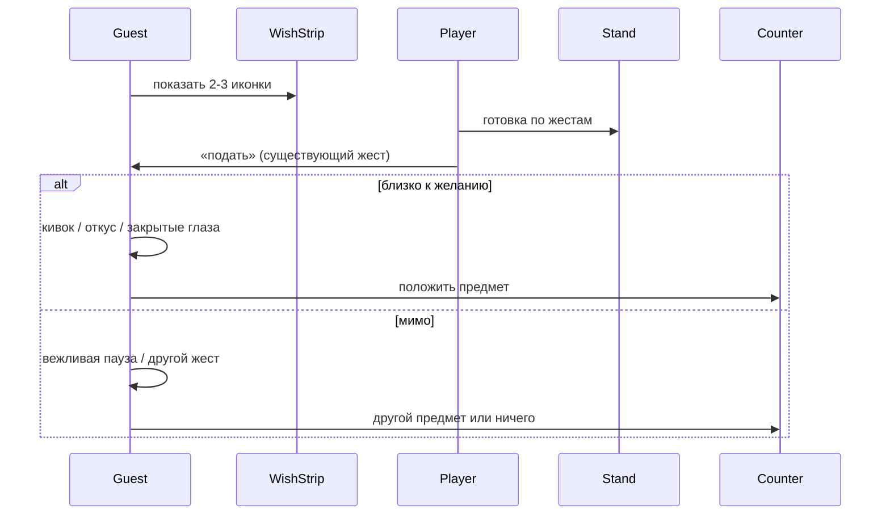

# v0 · один экран «гость без слов»

> Спецификация **минимального мета-среза**: один фон из mockups, без карты, без каталога UI.
> Цель — проверить, что **зачем печь** читается без текста. North star v0 — `north-star.md` (B).

## Scope v0

| Включено | Исключено |
|----------|-----------|
| Один локальный фон (напр. `riverside-grandmother.jpg`) | Карта точек, выбор маршрута |
| Один гость за «смену» (можно сменить кнопкой debug) | Очередь, таймер, давление |
| 2–3 иконки «желание» + реакция жестом | Диалоги, книга рецептов, квест-log |
| Подача роти → предмет на стойку | Обменная лавка, экономика излишков |
| Стенд готовки как сейчас (шаги 1–7 по мере готовности стенда) | Новые жесты только ради мета |

## Раскладка экрана (альбом / телефон)

```
┌─────────────────────────────────────────────┐
│  [фон локации — верхняя половина или blur]   │
│         гость (силуэт / bust, мало анимации) │
├─────────────────────────────────────────────┤
│  wish strip:  [🍌] [🥚] [☁ sugar]  (2–3 max) │  ← только пiktogramмы
├─────────────────────────────────────────────┤
│  ┌─────────────── стенд готовки ───────────┐ │
│  │  тесто │ тава │ (как dough-closeup)     │ │
│  └─────────────────────────────────────────┘ │
├─────────────────────────────────────────────┤
│  counter strip: пустые слоты → подарок       │
└─────────────────────────────────────────────┘
```

**Wish strip:** не «заказ на 100%». Иконки = **направление**, не рецепт: игрок может ошибиться; ошибка = другая реакция, не fail (канон дизайн-дока).

**Counter strip:** 1–3 слота. После удачной подачи гость **кладёт** предмет (анимация руки → слот). Тап по предмету — только осмотр (иконка + звук), без описания текстом.

## Поток без слов



## Иконки желания (v0 набор)

| Иконка | Что игрок меняет в готовке | Не обязано быть exact |
|--------|----------------------------|------------------------|
| Банан | начинка / сладость | можно без банана, но слаще |
| Яйцо | начинка | |
| Сахар / condensed | полив, посыпка | |
| Солнце / дождь (опц.) | прожарка / хруст | только если уже есть в стенде |

Новые иконки не добавлять, пока не проходит **один** полный цикл с тремя выше.

## Реакции гостя (без текста)

| Код | Анимация 1–2 с | Звук |
|-----|----------------|------|
| `glad` | кивок, улыбка, откус | короткий «мм» / смех |
| `ok` | нейтральный кивок | тишина + ambient |
| `surprised` | наклон головы | вдох |
| `sad` | медленное покачивание | ветер / дождь чуть громче |

Нет красных крестиков, нет «Game Over», нет звёздочек рейтинга.

## Предметы в обмен (v0 — три пробных)

| После реакции | Предмет на стойке | Зачем игроку |
|---------------|-------------------|--------------|
| `glad` + бабушка у воды | сложенный платок / мятная ветка | декор тележки (позже) |
| `glad` + турист | монета-**не деньга**: брелок, фото-уголок | сувенир, не валюта |
| `ok` + школьница | закладка, резинка для волос | то же |

Предмет **не расходуется** в v0; инвентарь не блокирует готовку.

## Оценка «близко к желанию» (v0 грубо)

Достаточно **бинарных флагов** из стенда, без ML:

- `has_banana` / `has_egg` / `drizzle_on` / `crust_golden` (из состояния блюда, когда появится карточка результата).
- Match: ≥2 из 3 показанных иконок **или** `crust_golden` если иконка «солнце».

Точные пороги — после первого плейтеста; в v0 лучше **завышать** `glad`, чем наказывать.

## Критерий готовности среза

1. Новый игрок **без подсказок текстом** понимает: иконки сверху = «к чему стремиться».
2. После первой подачи понимает: жест гостя = оценка; предмет = «спасибо».
3. Хочется сделать **ещё одно** роти из следующего шарика теста — не из-за очков, а из-за человека.

## Следующий шаг в коде (не в этом доке)

- Встроить фон mockup в `scene.html` / обёртку стенда (ветка continuation).
- `counter-item.js` уже есть в worktree — привязать к событию `serve` + `reaction`.
- Не открывать issues карты (#63–#65) до PASS критериев выше.
