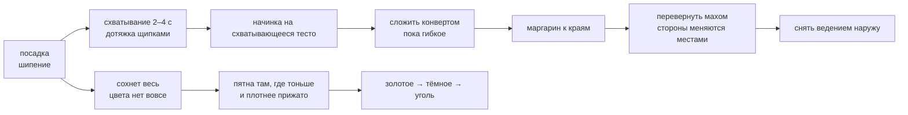

# Жарка на таве

- материал-из: [Лист на столе](<Лист на столе.md>)
- расширения-из: [Тележка — музей отношений](<Тележка — музей отношений.md>)

На вогнутой кратхе `กระทะโรตี` **палец = лопатка**: интерфейса нет, все жесты жарки — той же семьи
«поднять и шлёпнуть». Готовность ведёт звук, а не процент.

## Каталог: что в жарке уже есть

| Строка | Что это | Состояние |
|---|---|---|
| Модель прожарки | `heat = pan(r) × oil(r,fat) × contact × cover`; `cook` растёт только после `dry = 1` | **в стенде** |
| Две стороны | у каждой поверхности своя сушка и цвет; цвет — только у прижатой к стали | **в стенде (ветка)** |
| Схватывание | окно 2–4 с после посадки; `set = mean(dry) > 0,25` | в модели есть; как запрет на растяжку — нет |
| Дотяжка щипками на таве | вариант A, принят **условно**: вернёт «липкость» — снимается (#19) | **нет в стенде** |
| Пузыри | купола на тонких целых местах; рядом с дыркой не растут; прижал — пшикнуло | **в стенде (ветка)**, садятся случайно; где именно садятся — источниками не решено |
| Маргарин | кусок у борта, круговой мах по краю; край с жиром хрустит, без жира бледный | **в стенде (ветка)**; в v0 бесконечный, в v1 — ресурс дня с обменной лавки |
| Переворот | резкий мах, лист летит с поворотом; доступен всегда, обязателен конверту | **в стенде (ветка)**, одна фаза; двухфазный «подсунуть → перевернуть» — следующая итерация |
| Прижим удержанием | плющит, лопает пузыри, ускоряет контакт | описан; отдельного жеста в стенде нет |
| Прожарка | три ступени: сырое → приготовленное → зажаренное; угля нет | **в стенде 21.09** |
| Готовность на слух | шипение глохнет, потрескивание учащается, спектр уезжает вверх | шипение и треск есть; **замер «снимать» в трёх условиях не проводился (#14)** |
| Снять | ведение наружу на стол, перелёт 0,35 с; отдельной доски нет | **в стенде (ветка)** |
| Время на таве | **три минуты потолок**; дальше остаётся зажаренным | **в стенде 21.09**; прибор 40 / 60 / 3 мин |

Откуда начинает (фактчек 26.08 с перепроверкой): **не из центра**. Сначала лист сохнет весь и цвета
нет вовсе, потом цвет идёт пятнами там, где тоньше и плотнее прижато, — не градиент.

## Часы: три минуты (владелица, 20.09.2026; расписано 21.09)

Игровое время на таве — **три минуты**, три ступени, дальше не жжётся.
Переход **отмечается** (строка, не ползунок). Сгущёнку на таву не льют — только после снятия.

| Минута | Имя | Что это |
|---|---|---|
| 1 | довольно сырое | шипит, цвета почти нет. Можно класть банан и яйцо, складывать. Масло и начинка **за эту минуту** задают темп |
| 2 | хорошо приготовленное | золотые пятна, нормальный роти |
| 3 и дальше | хорошо зажаренное | тёмные пятна, хруст. Держать хоть пять минут — **остаётся этим**, не углём |

Масло, нажим и начинка крутят **скорость прыжка**, не названия.

| Рычаг | Физика | В стенде |
|---|---|---|
| Толщина | тонкое сохнет быстрее | как было: `thin` на сушку |
| Масло, плёнка | зазор, +5…20 % тепла, хруст | `oilMul` 1,00…1,09 |
| Масло, лужа | толще мм — изолятор | `oilMul` падает | 
| Без масла | липнет, бледно | `oilMul` 0,90 |
| Нажим | контакт, пузыри | локально, как было |
| Банан | вода + сахар | тень начинки; середина дольше сырая |
| Яйцо | вода + белок | тень сильнее банана |
| Сгущёнка | сахар | **не на таве** |
| Много начинки | масса и вода | первая минута длиннее в середине |
| Начинка на 2-й минуте | на корочку | локально, часов назад не отматывает |
| Конверт | швы в масле первыми | база под начинкой бледнее |

Положили на второй: тесто уже схватилось, начинка жарится сама, четвёртой ступени нет, складывать хуже.

В стенде: `COOK_RATE` под три минуты, потолок `COOK_CAP` (без угля), ступень из сушки/цвета, прыжок в строке. Кнопки 40 / 60 / 3 мин — проба в приборе.

## Чем ограничена

- **Конверта как состояния нет ни в одной копии модели:** ни геометрии сложенного листа, ни поля
  «слой», ни правила, чему равен `contact` у двух соприкасающихся поверхностей. Прямо признано
  невозможным на нынешней сетке (#20).
- **Начинки как вещества нет:** только множитель `cover`. Ни количества, ни растекания яйца, ни
  поведения при перевороте.
- **Температуры не хранит никто:** все три копии считают мгновенный поток `heat`, состояния плиты нет.
- **Хруст назван целью шага 6, но величины не имеет** ни в одной копии.
- Бюджет 30–60 с был под упрощённые шаги 3 и 6. **20.09 владелица заменила его на три минуты и три ступени** (см. выше). Старый множитель стенда не выкидываем, пока жарку не трогаем.
- Порядок цвета конверта в стенде («база → клапаны») **обратен** тому, что написан в спецификации;
  сам тот порядок источниками не подтверждён.
- Звукового прототипа нет ни в проекте, ни в плане, хотя ревью предлагало сделать его раньше арта —
  он арт-нейтрален.
