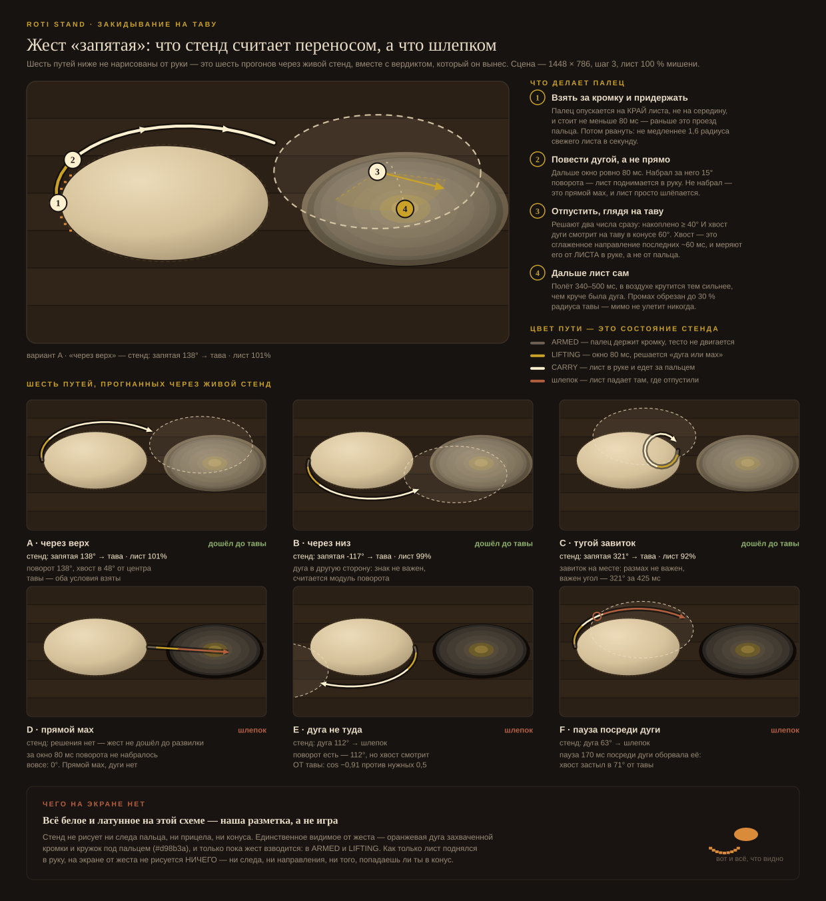

# Как устроено тесто в стенде

> Обновлено 08.09.2026, сборка «раскладка по ориентации · тава больше роти». Это описание того,
> что реально написано в `index.html` — не намерений. Если код разойдётся с этим файлом, файл обновить.

## Модель листа: сетка из узлов и «волокон»

Тесто — **равномерная решётка 38×38, обрезанная по кругу**: ~1060 узлов и ~4000 связей
(горизонтальные, вертикальные и обе диагонали каждой ячейки — диагонали держат сдвиг).
Узел — точка теста с позицией и скоростью. Связь — «волокно» с **длиной покоя**: сколько
ей положено быть в ненапряжённом состоянии.

Раньше сетка была полярной (24 кольца × 48 спиц) — она вырождалась в центре и рвалась
сама от любого движения; это опровергнуто замером в первый же день.

## Решатель: XPBD

Каждый кадр — 8 подшагов. В каждом: узлы двигаются по скоростям с затуханием → каждая
связь подтягивает свои два узла к длине покоя (насколько жёстко — ползунок **упругость**) →
скорости пересчитываются из фактического сдвига. Это стандартный position-based подход
(XPBD), тот же класс, что в тканевых симуляциях.

## Пластичность: почему растяжение остаётся

Чисто упругая сетка пружинит обратно и «прозрачного листа» не даёт — это было опровергнуто
замером. Поэтому связи **запоминают** растяжение: если связь растянута сильнее порога,
её длина покоя ползёт к фактической длине (скорость — ползунок **текучесть**). Плюс
выравнивание: перетянутые волокна отдают недотянутым, иначе лист рвался у пальца, не дойдя
до цели. Общий потолок растяжимости — 125 % от мишени: дальше тесто не растёт ни одним путём.

## Толщина: сохранение объёма

У каждой ячейки запомнена площадь при рождении. **Толщина = была / стала.** Выросла площадь
вдвое — ячейка вдвое тоньше. Цвет считается из толщины: толстое — непрозрачное бежевое,
тонкое темнеет к цвету стола, то есть «просвечивает». Никакого отдельного счётчика толщины
нет — она следствие геометрии.

## Раскладка стола: две, по ориентации кадра

Стол делится на **рабочую зону** (тесто) и **зону тавы** — по ДЛИННОЙ стороне кадра
(⚑ решение владельца 08.09.2026):

- **альбом** — тесто слева, тава справа, деление по ширине 50/50;
- **портрет** — тесто внизу, тава вверху, деление по высоте, и лист закидывается снизу вверх.

Жест на раскладку не смотрит: конус прицела считается на центр тавы, поэтому «запятая»
поворачивается вслед за ней сама.

Вертикальные границы зон берутся по **видимой полосе стола**, а не по числу `cv.height`:
перспектива сжимает стол в `TILT = 0,56` раза, и координата `y = cv.height` приходится
примерно на 3/4 высоты кадра — считая по `cv.height`, нижнюю четверть не занимал никто.

**Размер тавы считается по свободному месту в кадре**, а не по доле зоны: от кромки теста
до края. В кадр обязан помещаться борт (1,08 радиуса), тень (1,16) может уходить за край.
Потолок — 1,45 полуширины роти, чтобы на вытянутом экране тава не раздулась вокруг крошечного
листа. Сравнивается именно полуширина роти НА ТАВЕ (`targetR` × перспектива), а не сам
`targetR`: лист рисуется поузловой проекцией, а тава — эллипсом от `PAN_R` без множителя.

Так тава стала шире роти в 1,26 раза в портрете и в 1,16 в альбоме. До 08.09 было 0,76 —
роти торчал за борт на любом экране; см. запись в `../../docs/decisions-log.md`.

## Жест: машина состояний

По `docs/slap-input-audit.md`, с ветвлением на переносе (25.08.2026):

```
RESTING → ARMED → LIFTING ─ прямой мах ──────────→ FLYING → IMPACT → SETTLING
                     └─ дуга ≥15° за 80 мс → CARRY ─ хвост к таве, дуга ≥40° → TOSS → посадка
                                               └─ иначе: лист опускается, дальше FLYING (шлепок)
```

Один объект `action` — единственный источник истины; один активный палец, второй игнорируется.

- **Шаг 1 — расплющить.** Прижатый палец растит длины покоя вокруг себя (сильнее под пальцем,
  слабее по всему куску) — кусок расползается в лепёшку. Дошёл до 42 % мишени — авто-переход
  на шаг 2, тем же листом.
- **Шаг 2 — растянуть.** Касание только выбирает дугу края (тесто не двигается!), прижим
  расширяет хват (насыщение за 100–250 мс), резкий мах классифицируется по скорости и
  направлению (нормировка на размер экрана, а не листа — один и тот же мах руки работает
  одинаково всю игру), 80–160 мс «полёта», затем **удар**: краткий импульс скоростей +
  одноразовое пластическое растяжение длин покоя с весами `0.35 + 0.45·край + 0.20·по-направлению-маха`.
  Скоростной импульс сам по себе площадь не растил (жёсткий решатель гасил его раньше
  пластичности — сработал стоп-сигнал аудита §6.6), поэтому рост закреплён явно.

## Перенос на таву: «запятая» (шаг 3)



Схема выше нарисована не от руки: пути на ней — прогоны синтетическими PointerEvents через
живой стенд вместе с вердиктом, который он вынес (три доходят до тавы, два нет). Цвет пути —
состояние автомата. Шестая клетка — не вариант жеста, а находка: путь A, прогнанный восемь раз
подряд без единого изменения, доходит до тавы пять раз из восьми (см. issue про гейт 15°).
Всё белое и латунное на схеме — разметка: сам стенд не рисует ни следа пальца, ни прицела,
ни конуса, а только оранжевую дугу хвата и кружок под пальцем, и только пока жест взводится.

Идея владельца 25.08.2026: лист перекидывается на таву **круговым махом-«запятой»** —
подхватить, повести дугой, хвост дуги отправляет в полёт; в воздухе лист немного вращается,
падает на таву и начинает жариться.

Как реализовано:

- Пока мах идёт, копится **знаковый угол поворота** направления скорости (`sweep`) и
  сглаженный «хвост» направления (последние ~60 мс). Прямой мах: `sweep ≈ 0`.
- Если за 80 мс LIFTING палец повернул ≥ **15°** — это дуга: лист поднимается в руку
  (**CARRY**), физика замирает, лист следует за пальцем (сдвиг + тень под ним). Вести можно
  ≤ 0,45 с; рука остановилась на 90 мс — дуга кончилась.
- На отпускании: если дуга ≥ **40°** и хвост смотрит на таву в конусе **60°** — **TOSS**:
  полёт 0,34–0,5 с по плавной кривой, поворот листа = 0,55 × дуга (потолок ±80°), подъём
  и посадка. Промах от центра тавы сохраняется, но обрезается 30 % её радиуса — мимо тавы
  лист не улетает. Иначе — лист опускается на стол, и это обычный шлепок с дугой.
- **Размером лист не ограничен** (⚑ решение владельца 08.09.2026): недотянутый несётся на таву
  так же, как готовый. Запрета нет и предупреждения нет — есть последствие: толстый лист
  медленнее сохнет и иначе набирает цвет. Строка решения называет размер в момент броска.
- Посадка «запекает» сдвиг и поворот в узлы, `phase = PAN`, глухой шлепок + волна шипения.
  Пороги (15° / 40° / конус 60°) на живом iPhone не калиброваны, как и пороги свайпа (#1).
- **Направление броска задаёт раскладка, а не код жеста**: в альбоме дуга уходит вправо,
  в портрете — снизу вверх. Обе стороны дуги (через верх и через низ) работают одинаково:
  знак `sweep` не проверяется нигде, важен только модуль и куда смотрит хвост.

В полёте узлы физики не двигаются: сдвиг, поворот и подъём — свойство картинки,
применяемое к узлам один раз при посадке (как FLYING — таймер, а не траектория).

## Жарка: заглушка

Честно: настоящей модели жарки в стенде нет, есть заглушка, чтобы посадка «начинала
жариться» и было что слушать. Предложение полной механики (две стороны, пузыри, маргарин,
лопатка, переворот) — `docs/frying-mechanics.md`, решений владельца по нему нет (#11).

- **Сначала сушка, потом цвет.** У узла две величины: `dry` растёт, пока не дойдёт до 1
  (скорость ∝ 1/толщина — толстое сохнет дольше), и только после этого начинает расти
  `cook` — цвет. Пока лист мокрый, цвета нет вообще: испарительное охлаждение держит
  контактную сторону у 100 °C, а цвет требует >120 °C. Буреет тонкая поверхностная ламина,
  поэтому в скорости окраски толщины уже нет.
- Общий множитель тепла: `panHeat(r)` (кольцевая горелка — лёгкий горб на среднем радиусе,
  0,90 в центре, 0,55 у борта; **inferred**, ИК-замера кратхи нет — #41) × масло
  (`1,05 + 0,10·max(0, 1 − r/0,35)`) × `contactF[i]` — статичное пятнистое поле 0,6…1,15,
  из-за которого цвет ложится **пятнами**, как «leopard spots» в источниках, а не градиентом.
- Пресет шага 3 даёт **почти однородный лист** (~0,19) с пятнистой неровностью ±33 %:
  плавное поле смещений из трёх волн, корреляционный масштаб ~полрадиуса. Радиальной карты
  толщины нет — цель растяжки по рецептам это равномерная просвечивающая тонкость,
  а кромочную губу срезают. Слепленный шлепками лист получает свой профиль сам.
- **История двух ошибок** (`docs/frying-mechanics.md` §1): сначала стенд грел «из центра»
  (домысел из вогнутого дна), потом получил радиальную толщину 3:1 (домысел из цитаты
  о преддиске). Обе поймала перепроверка с задачей опровергнуть.
- Цвет: сырое → золотистое → коричневое → тёмное → чёрное.
- **Звук ведёт сушка, а не цвет,** и потому опережает его: шипение громкое, пока мокро,
  глохнет и уходит вверх по тону; треск учащается. «Суше и звонче» слышно раньше,
  чем видно золото.
- Звук: **шипение** громче, пока «в тесте вода» (низкий `cook`), и глохнет к сухому;
  полоса фильтра уезжает вверх — «суше и звонче»; **потрескивание** редкое на мокром,
  частое на сухом. Процентов на экране нет — прожарка видна только в строке замера.
- Жесты жарки не реализованы: лист на таве не трогается, «заново» даёт новый кусочек.

## Разрыв: узор, не провал

Связь может лопнуть; ячейка с лопнувшей связью **не рисуется** — это и есть дырка.
Симуляция не останавливается, тесто не переделывается: как порвал, так и пожаришь.

Правило дырки: **сильный шлепок (сила ≥ 2,9 из 3,5) по уже тонкому листу (минимальная
толщина < 0,20)** пробивает рваное пятно на дальней стороне по направлению маха — с неровным
краем (радиус пятна дрожит случайно). Глобальный порог толщины стили не различает — замер
показал, что аккуратный и жёсткий стили приходят к почти одинаковой толщине (0,108 против
0,083); опасность именно в сочетании «сильно × по тонкому». Треск — на каждую новую дырку.

## Честно про наложение — ответ на прямой вопрос

**Сетка двумерная, самостолкновений нет вообще.** Лист может наложиться сам на себя —
проверки «прошёл ли кусок сквозь другой кусок» не существует, и склейки не существует:
наложившиеся части просто рисуются друг поверх друга и расходятся, когда связи их растащат.
При нынешних жестах (расплющивание, радиальные шлепки) складывание почти не случается.

Следствие, о котором надо помнить заранее: **шаг «складывание конвертом» из v3 на этой
модели невозможен без доработки** — там наложение и есть механика, понадобятся слои,
высота или переход к 2.5D (#20). Это же ограничение зафиксировано линзой T2 и аудитом
(группа C — 3D-физика — запрещена до положительного живого теста жеста).

## Три числа «ощущения» — и где они живут

Упругость, текучесть и запас прочности задаются ползунками «ощущение», а не литералами в коде.
При исходном положении ползунков (30 / 30 / 72) действуют:

| параметр | значение | что значит |
|---|---|---|
| `COMPLIANCE` | **1,37 · 10⁻⁶** | податливость связи: больше — мягче |
| `CREEP` | **0,31** | скорость, с которой длина покоя догоняет фактическую |
| `THICK_BREAK` | **0,0148** | доля исходной толщины, ниже которой связь рвётся |

**Читать их можно только в одном месте** — блок «ощущение теста» в начале `index.html`, где стоят
и формулы, и исходная точка. До 08.09.2026 рядом жили литералы `COMPLIANCE 1e-5`, `THICK_BREAK 0,020`
и `CREEP 0,55`, которые `applyTune()` перетирал при старте: **в работе они не участвовали никогда**
(#57). Литералы убраны, чтобы сверка «модель против кода» не сравнивала модель с числами, которых нет.

Ползунки переживают перезагрузку, поэтому замер можно снять на чужой настройке. С 08.09 панель
об этом говорит: если ощущение не исходное, в строке появляется `⚙ ощущение своё` с обоими наборами.

## Чего ещё нет (осознанно)

- **Изгибной жёсткости** — лист ведёт себя как плёнка, а не как пласт с телом.
- **Трения о стол** по зонам и масла — затухание одно на весь лист, меняется только фазой жеста.
- **Настоящего полёта** — FLYING это таймер 80–160 мс, а TOSS — кривая с поворотом,
  не 3D-траектория (по аудиту: игроку важна последовательность «взял → бросил → услышал →
  увидел», а не физика каждого узла в воздухе).
- **Предупреждения о разрыве** — убрано решением владельца 22.08.2026: гудения «сейчас порвусь»
  нет, лист просто рвётся, и это слышно треском.
- **Жестов на таве** — дотяжка, начинка, конверт, лопатка, переворот: см. `docs/frying-mechanics.md`.
- **Шага 2 перед переносом не требуется** — пресет шага 3 сразу даёт растянутый тонкий лист
  (масштабирование позиций и длин покоя от честных «площадей при рождении» маленького комка).

## Где читать дальше

- `HYPOTHESIS.md` — что стенд обязан измерить и по каким критериям.
- `RESULT.md` — журнал всех находок и опровержений, от полярной сетки до шлепка.
- `../../docs/slap-input-audit.md` — аудит ввода: диагноз, state machine, план проходов.
- `../../docs/simulation-references.md` — источники по симуляции листа: самоконтакт для слоёв,
  MPM про выпечку, FEM раскатки; бюджет самоконтакта на телефоне (по исследованию «Ролльни»).
- `../../review/raw/T2-sim.md` — линза ревью о симуляции и звуке: бюджеты узлов, задержки.
- `../../docs/decisions-log.md` — принятые решения владельца.
